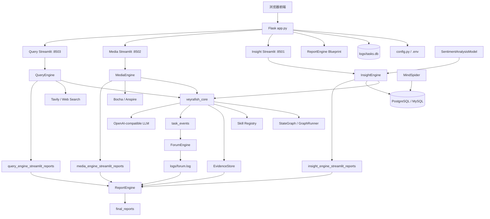

# 维舆 Veyrafish

> 多智能体舆情分析、信息检索、社媒洞察与自动报告生成平台

[](https://www.python.org/)
[](https://flask.palletsprojects.com/)
[](https://streamlit.io/)
[](https://www.docker.com/)
[](LICENSE)

维舆 Veyrafish 是一个面向舆情分析与信息研判的多智能体系统。用户输入一个自然语言议题后，系统会调度 Query、Media、Insight、Forum、Report 等多个专业智能体，从公开网页、多模态搜索、本地社媒数据库和协作上下文中获取信息，经过多轮搜索、反思、证据抽取和报告生成，输出可阅读、可导出、可复盘的综合分析报告。

当前项目已经从原始的 `Flask + Streamlit 子进程 + 文件产物` 演进为包含任务状态层、Agent Runtime、Skill 能力层、Evidence 证据层、Report Document IR 和多页前端工作台新型平台。

## 项目定位

维舆不是单一搜索器，也不是普通报告生成器，而是一套完整的舆情研判流水线：

```text
用户议题
  -> 多 Agent 并行分析
  -> Forum 智能体协作与校准
  -> Evidence 证据沉淀
  -> ReportEngine 结构化报告生成
  -> HTML / PDF / Markdown / IR 导出
```

适用场景包括社会热点分析、品牌声誉监测、危机公关研判、行业趋势分析、政企决策辅助、教学科研和竞赛演示。

## 核心能力

| 能力 | 说明 |
|---|---|
| 多智能体分析 | Query、Media、Insight 分别负责网页新闻、多模态搜索和本地社媒数据库洞察 |
| Agent 论坛协作 | ForumEngine 聚合 Agent 输出，由主持人模型生成引导、质疑和补充方向 |
| 任务状态层 | `task_store.py` 使用 SQLite 记录任务、事件和证据 |
| Agent Runtime | `veyrafish_core` 提供 StateGraph、GraphRunner、BaseResearchAgent、Dispatcher |
| Skill 能力层 | query rewrite、summary、evidence extract、quality gate、gap finder、sentiment 等能力可复用 |
| Evidence 证据层 | 将关键 claim、来源、置信度和上下文结构化沉淀 |
| ReportEngine | 支持模板选择、章节生成、Document IR、HTML/PDF/Markdown 渲染与导出 |
| 多页前端 | 总览、洞察、媒析、检索、论坛、报告六页工作台 |
| Docker 支持 | 提供远程镜像 compose、本地源码构建 compose 和 PostgreSQL 容器配置 |

## 系统架构



## 模块一览

| 路径 | 作用 |
|---|---|
| `app.py` | Flask 主编排、页面路由、子进程管理、配置 API、Socket.IO |
| `config.py` | Pydantic Settings，全局 `.env` 配置入口 |
| `task_store.py` | SQLite 任务、事件、证据状态层 |
| `veyrafish_core/` | Agent Runtime、Graph、Skill、Evidence、Dispatcher、回放评估 |
| `QueryEngine/` | 新闻和网页广度搜索 Agent |
| `MediaEngine/` | 多模态搜索与结构化搜索卡片分析 Agent |
| `InsightEngine/` | 本地社媒数据库洞察 Agent |
| `ForumEngine/` | Agent 论坛协作与主持人引导 |
| `ReportEngine/` | 报告生成、Document IR、HTML/PDF/Markdown 渲染 |
| `MindSpider/` | 热点新闻、社媒内容和评论采集 |
| `SentimentAnalysisModel/` | 情感分析模型集合 |
| `SingleEngineApp/` | 三个 Streamlit 单引擎调试页面 |
| `templates/` | Flask 多页前端模板 |
| `static/` | 前端共享 CSS/JS 和静态资源 |
| `docs/` | 设计、开发、部署、需求、计划和实施文档 |
| `tests/` | 单元、集成、回归测试 |

## 当前状态

- 原始多 Agent 舆情分析链路已经具备完整产品形态。
- 工程治理、任务状态层、Graph Runtime、Skill、Evidence 和 Report IR 已形成主干。
- 前端已拆分为六页工作台，并接入维舆视觉风格。
- Docker 配置、部署文档和开发文档已补齐。
- Docker 正式验收、浏览器全量实机验收、真实 LLM 端到端稳定演示仍需继续收口。

对外表达建议：代码主路径和文档资产已补齐，正式产品验收仍在进行中。

## 快速开始：Docker

```bash
cp .env.example .env
```

Docker Compose 使用内置 PostgreSQL 服务时，`.env` 中数据库建议配置为：

```env
DB_DIALECT=postgresql
DB_HOST=db
DB_PORT=5432
DB_USER=veyrafish
DB_PASSWORD=veyrafish
DB_NAME=veyrafish
DB_CHARSET=utf8mb4

POSTGRES_USER=veyrafish
POSTGRES_PASSWORD=veyrafish
POSTGRES_DB=veyrafish
POSTGRES_PORT=5444
```

容器内应用访问数据库应使用 `DB_HOST=db` 和 `DB_PORT=5432`，不要使用 `localhost`。

远程镜像启动：

```bash
docker compose up -d
```

本地源码构建：

```bash
docker compose -f docker-compose.local.yml up -d --build
```

访问：

```text
http://localhost:5000
```

完整 Docker 说明见：[Docker 部署与调试指南](docs/deployment/2026-04-24-veyrafish-docker-deployment-guide.md)。

## 快速开始：源码运行

推荐 Python 3.11。

```bash
python -m venv .venv
python -m pip install -r requirements.txt
cp .env.example .env
python app.py
```

Windows PowerShell 激活虚拟环境：

```powershell
.\.venv\Scripts\Activate.ps1
```

使用 `pyproject.toml` 开发依赖：

```bash
python -m pip install -e ".[web,db,report,dev]"
```

单独调试某个 Agent：

```bash
streamlit run SingleEngineApp/insight_engine_streamlit_app.py --server.port 8501
streamlit run SingleEngineApp/media_engine_streamlit_app.py --server.port 8502
streamlit run SingleEngineApp/query_engine_streamlit_app.py --server.port 8503
```

单独调试报告生成：

```bash
python report_engine_only.py --query "测试主题"
python regenerate_latest_html.py
python regenerate_latest_md.py
python regenerate_latest_pdf.py
```

## 使用流程

1. 启动主应用。
2. 打开首页 `/`。
3. 检查或填写系统配置。
4. 点击启动系统，等待三个 Agent 子应用启动。
5. 输入分析议题。
6. Query、Media、Insight 分别生成中间研究结果。
7. ForumEngine 聚合 Agent 输出并生成协作上下文。
8. 打开报告页 `/report` 生成最终报告。
9. 导出 HTML、PDF 或 Markdown。

## 测试

运行全量测试：

```bash
python -m pytest tests/
```

按模块运行：

```bash
python -m pytest tests/test_task_store.py
python -m pytest tests/test_graph.py tests/test_graph_integration.py
python -m pytest tests/test_skill.py
python -m pytest tests/test_evidence_store.py
python -m pytest tests/test_monitor.py tests/test_forum_events.py
python -m pytest tests/test_report_engine_sanitization.py
python -m pytest tests/test_replay_eval.py
```

## 文档入口

| 文档 | 用途 |
|---|---|
| [整体项目设计文档](docs/design/2026-04-24-veyrafish-overall-project-design.md) | 项目背景、架构、模块、流程、数据、API 和路线 |
| [当前项目设计文档](docs/design/2026-04-24-veyrafish-current-project-design.md) | 当前修改、阶段进展和验收边界 |
| [整体项目开发指南](docs/development/2026-04-24-veyrafish-overall-development-guide.md) | 环境、启动、调试、扩展、测试和交付检查 |
| [Docker 部署与调试指南](docs/deployment/2026-04-24-veyrafish-docker-deployment-guide.md) | Docker Compose、环境变量、端口、日志、验收清单 |
| [模块分析](MODULE_ANALYSIS.md) | 模块边界、数据契约、耦合关系和二开路线 |
| [二次开发指南](DEVELOPMENT.md) | 原始二开说明和模块细节 |
| [升级方向](UPGRADE_DIRECTIONS.md) | 后续架构演进建议 |
| [实施清单](docs/implementation/MASTER_IMPLEMENTATION_CHECKLIST.md) | Phase 0/1/2/3 进度和门禁 |
| [Skill 总览](docs/skills/README.md) | 项目内 Skill 分层和 spec 入口 |

## 开发扩展

常见扩展方向：新增搜索工具、新增 Agent、新增 Skill、新增报告块、新增前端页面、修改数据库 Schema。详细步骤见：[整体项目开发指南](docs/development/2026-04-24-veyrafish-overall-development-guide.md)。

## 产物目录

| 目录 | 说明 |
|---|---|
| `logs/` | 日志、`tasks.db`、运行状态 |
| `final_reports/` | 最终 HTML/PDF/Markdown/IR 报告 |
| `insight_engine_streamlit_reports/` | Insight 中间报告 |
| `media_engine_streamlit_reports/` | Media 中间报告 |
| `query_engine_streamlit_reports/` | Query 中间报告 |
| `outputs/` | runtime 收据、回放产物、治理记录 |
| `db_data/` | Docker PostgreSQL 数据目录 |

## 已知限制

- Docker 配置已存在，但正式 Docker 验收仍需继续执行。
- 浏览器全页面实机验收和移动端检查仍需补齐。
- 真实 LLM + 搜索 API 的端到端稳定演示依赖有效 Key 和网络环境。
- `forum.log` 和 `*_streamlit_reports/*.md` 仍是兼容链路的一部分，尚未完全由任务状态层替代。
- `templates/index.html` 仍有历史内联逻辑，后续可继续拆分。
- Playwright Chromium 在 Dockerfile 中默认不下载，需要时通过 build arg 或容器内命令安装。

## 路线图

近期重点：完成 Docker + 浏览器 + 真实 LLM 最小演示验收，打通 task_id 全链路，让 ReportEngine 和 ForumEngine 更优先消费结构化 task/evidence/event。

中长期方向：API-first 重构、Worker/队列化长任务、插件化模板/工具/Agent、完整回放评估体系、OpenTelemetry 可观测性、权限审计和团队协作能力。

## 免责声明

本项目仅用于学习、研究、教学和合规场景。项目中涉及的搜索、爬虫、舆情分析和报告生成能力，不得用于违法违规、侵犯隐私、恶意爬取、商业滥用或任何违反目标平台协议的行为。使用者应自行确认数据来源、API 使用、平台规则和当地法律法规要求，并对使用行为承担责任。

## 许可证

本项目采用 [GPL-2.0](LICENSE) 许可证。
