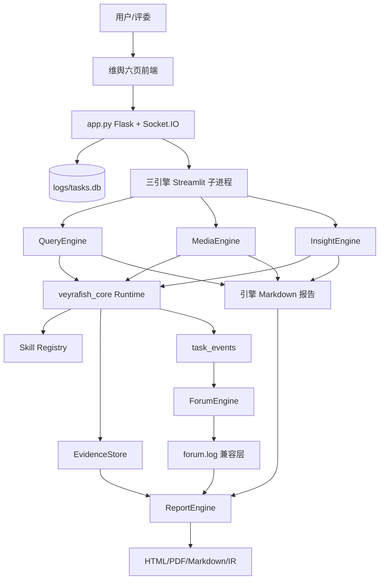
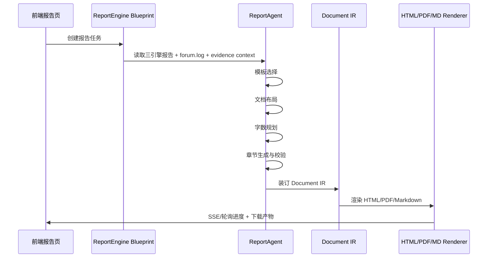

# Veyrafish 当前项目详细设计文档

**版本**：2026-04-24 当前实现态  
**项目路径**：`d:\user\landx\Desktop\computer design competition\BettaFish-main`  
**文档性质**：基于当前仓库修改和实施进展的设计说明  
**适用场景**：比赛答辩、开发交接、后续验收、Docker 调试前架构确认  

> 重要说明：当前目录不是 Git 工作树，本文档不能使用 `git diff` 还原改动，而是依据当前文件内容、文件时间、实施清单、需求/计划文档和源码结构进行整理。

## 1. 设计结论

Veyrafish 当前已经从原始的“Flask + 三个 Streamlit 子进程 + 日志文件/Markdown 文件协作”的 Demo 型多智能体舆情分析系统，演进为一个仍保持兼容运行方式、但已具备任务状态层、显式 Agent Runtime、Skill 资产化、Evidence 证据层、事件驱动 Forum 试点和多页产品前端的竞赛交付型系统。

当前最准确的状态表述是：

**代码主路径和文档资产已大幅补齐，正式验收仍未完成。**

具体含义：

- 工程治理：`pyproject.toml`、配置集中化、测试基线、开发文档已建立。
- 运行架构：`task_store.py` 已提供 SQLite 任务状态层，`/api/system/start` 已从请求线程中抽离。
- Agent Runtime：`veyrafish_core` 中已有 `StateGraph`、`GraphRunner`、`BaseResearchAgent`、`SkillRegistry`、`EvidenceStore` 等核心能力。
- 三引擎：Query / Media / Insight 仍保留原业务分工，但主链路已朝 `BaseResearchAgent + graph + skill + evidence` 收敛。
- Forum：保留 `forum.log` 兼容层，同时具备从 `task_events` 读取结构化事件的事件驱动路径。
- Report：仍是系统最成熟的产出层，具备模板选择、章节生成、Document IR、HTML/PDF/Markdown 导出能力，并已开始消费 evidence context。
- 前端：从单页控制台演进为总览、Insight、Media、Query、Forum、Report 六页结构，视觉上接入“维舆”新中式水墨设计。
- 验收：单测和离线回放入口已有记录；Docker、浏览器实机、真实 LLM 联调仍是阻塞项。

## 2. 当前进展账本

| 阶段 | 当前状态 | 已落地内容 | 未完成或阻塞 |
|---|---|---|---|
| Phase 0 工程治理 | 进行中，核心项已完成 | `pyproject.toml`、依赖分组、配置集中化、测试基线、开发文档 | 干净环境安装验证、契约测试目录、trace id 贯通仍待补 |
| Phase 1 运行架构 | 完成核心 | `task_store.py`、后台 Thread 启动任务、任务查询接口、zombie task 清理、61/61 测试记录 | 文件总线仍未完全降级，取消任务和完整事件流未完成 |
| Phase 2 Agent Runtime | 进行中，代码门禁第一轮通过 | `StateGraph`、`GraphRunner`、Skill Registry、三引擎图谱化、Forum 事件驱动、EvidenceStore | Docker、真实 LLM、浏览器联调未通过，不能算正式完成 |
| Phase 2.5 收口 | 代码主路径完成，正式验收未完成 | Skill contract、BaseResearchAgent 深接线、Reflection/Forum/Report evidence context、固定样例回放 | Wave 3/4 因正式验收阻塞未勾选完成 |
| Phase 3 前端产品化 | 进行中，静态实现为主 | 六页拆分、水墨视觉、SVG/PNG 资产路由、共享 CSS/JS、系统菜单、五引擎入口 | 浏览器实机、移动端、真实数据图表、最近任务/报告等仍待完成 |
| Skill 资产化 | 第一批完成，第二批推进 | 核心 4 个 skill spec，`sentiment_analysis`、`web_search` 第一轮增强 | 前端调试展示、示例集、持续 contract 对齐待补 |
| 评估与回放 | 最小闭环已建立 | 固定样例、评分维度、离线回放产物 | live replay 未通过，真实正式验收未完成 |

## 3. 设计目标

当前设计围绕“比赛可演示 + 后续可工程化”两条线展开：

1. 保住原始 Veyrafish 的多智能体舆情分析能力。
2. 让三引擎、Forum、Report 的运行过程可追踪、可恢复、可验证。
3. 把原先分散在 prompt、脚本和日志里的能力沉淀为 `veyrafish_core`、Skill 和 Evidence。
4. 将前端从工程控制台升级为有清晰产品路径的“维舆”工作台。
5. 在不大爆炸重构的前提下，为未来 FastAPI、Worker、任务状态主通路、插件化和回放评估留出边界。

## 4. 非目标

当前项目没有完成，也不应被描述为已经完成以下事项：

- 完整 FastAPI 重构。
- 完整 Celery/Worker 生产化队列。
- 微服务拆分。
- 文件总线彻底消失。
- Docker 正式验收通过。
- 浏览器全页面实机验收通过。
- 真实 LLM 端到端稳定演示通过。
- 前端所有图表均接入真实结构化数据。
- 完整插件市场。

## 5. 总体架构

当前系统可以分为七层：

1. **前端产品层**：`templates/*.html` + `static/engine-shared.css` + `static/engine-shared.js` + `static/veyu-ui.css`
2. **Web 编排层**：`app.py`，负责 Flask 路由、Socket.IO、子进程生命周期、系统启动/关闭、配置读写
3. **任务状态层**：`task_store.py`，用 SQLite 持久化任务、事件和 evidence 表
4. **Agent Runtime 层**：`veyrafish_core/`，提供图执行、节点基类、Agent 基类、Skill、Evidence、并发调度
5. **业务引擎层**：`QueryEngine/`、`MediaEngine/`、`InsightEngine/`、`ForumEngine/`、`ReportEngine/`
6. **数据与工具层**：PostgreSQL/MySQL、MindSpider、外部搜索 API、OpenAI 兼容 LLM、情感分析模型
7. **输出与回放层**：`*_streamlit_reports/`、`logs/`、`final_reports/`、`outputs/`



## 6. 核心运行链路

### 6.1 系统启动链路

当前系统启动从 `/api/system/start` 发起：

1. 前端点击启动系统。
2. `app.py` 创建 `system_start` 任务，写入 `logs/tasks.db`。
3. 接口立即返回 `task_id`，前端可轮询 `/api/system/task/<task_id>`。
4. 后台 Thread 执行 `initialize_system_components()`。
5. 初始化数据库、论坛日志和三个 Streamlit 子应用。
6. 启动 ForumEngine 监控。
7. 成功或失败结果写回 TaskStore。

这个改造的意义是：启动动作不再阻塞 Web 请求线程，系统可以给前端一个可追踪的启动任务。

### 6.2 分析任务链路

用户输入查询后，主流程仍保留旧系统兼容路径：

1. 前端调用 `/api/search`。
2. `app.py` 判断正在运行的引擎。
3. 对 `insight`、`media`、`query` 并发转发到对应 Streamlit 子应用端口。
4. 各引擎执行自己的 `research()`。
5. `BaseResearchAgent` 在支持 task_id 的路径上写入 `task_events` 和 evidence。
6. 引擎生成 Markdown 报告到对应 `*_streamlit_reports/` 目录。
7. ForumEngine 通过日志或事件聚合 Agent 发言。
8. ReportEngine 读取最新引擎报告、论坛日志和可选 evidence，生成最终报告。

### 6.3 报告生成链路

ReportEngine 是当前最完整的产出模块：



## 7. 模块设计

### 7.1 `app.py` Web 编排器

`app.py` 当前仍是系统主入口，主要职责包括：

- 注册 Flask 页面路由：`/`、`/insight`、`/media`、`/query`、`/forum`、`/report`
- 注册静态资产路由：`/assets/png/<filename>`、`/assets/svg/<filename>`
- 注册 ReportEngine Blueprint：`/api/report/*`
- 管理三个 Streamlit 子进程：`insight`、`media`、`query`
- 管理 ForumEngine 启停
- 处理配置读写：`GET/POST /api/config`
- 处理系统启动和关闭：`/api/system/start`、`/api/system/shutdown`
- 提供任务查询：`/api/system/task/<task_id>`、`/api/system/tasks`
- 提供 evidence 查询：`/api/evidence/<task_id>`
- 推送 Socket.IO 事件：日志、状态、论坛消息

设计取舍：

- 保留 Flask 和 Streamlit 子进程，是为了降低重构风险。
- 新增 TaskStore，是为了让长任务状态开始脱离单纯内存变量。
- 保留文件日志和 Markdown 输出，是为了兼容 ReportEngine 和前端已有路径。

### 7.2 `task_store.py` 任务状态层

`task_store.py` 是 Phase 1 的核心增量。它使用 SQLite 文件 `logs/tasks.db` 保存三类数据：

| 表 | 作用 | 关键字段 |
|---|---|---|
| `tasks` | 记录长任务生命周期 | `task_id`, `task_type`, `status`, `payload`, `result` |
| `task_events` | 记录节点级进度和运行事件 | `task_id`, `event_type`, `node_name`, `paragraph`, `detail` |
| `evidence` | 记录结构化证据 | `task_id`, `engine`, `paragraph_index`, `claim`, `source`, `confidence` |

当前状态：

- 已支持创建、更新、查询和列表。
- 已支持 zombie task 清理。
- 已支持通过 `get_completed_paragraphs()` 为断点恢复提供依据。
- 仍未成为全系统唯一主状态通路，`processes` 内存状态和文件总线仍存在。

### 7.3 `veyrafish_core` Agent Runtime

`veyrafish_core/` 是二阶段架构升级的核心目录。当前职责：

- `graph.py`：自研 `StateGraph` 和 `GraphRunner`
- `base_research_agent.py`：三引擎共用研究流程基类
- `base_node.py`：节点抽象
- `llm_client.py`：OpenAI 兼容 LLM 客户端抽象
- `dispatcher.py`：三引擎并发调度库层能力
- `skill.py`：Skill 基类、上下文、预算
- `skills/`：项目内业务 Skill
- `evidence_store.py`：共享证据层
- `output_models.py`：结构化输出模型
- `replay_eval.py`：回放和评分能力

设计目标：

1. 把原先各引擎中的隐式 for-loop 和 prompt 逻辑抽象为可观察的状态图。
2. 让节点开始写入结构化事件。
3. 让查询改写、摘要、证据抽取、质量门禁等能力以 Skill 形式复用。
4. 让最终报告不只依赖散文式 Markdown，也能使用 evidence context。

当前限制：

- 恢复机制主要基于 `paragraph_done` 事件，不是完整 Agent State checkpoint。
- 图谱化主路径已有代码接线，但真实 LLM 和浏览器端正式验收未完成。

### 7.4 三个分析引擎

| 引擎 | 路径 | 主要职责 | 数据源 |
|---|---|---|---|
| QueryEngine | `QueryEngine/` | 国内外新闻广度搜索，多轮搜索反思总结 | Tavily 等搜索 API |
| MediaEngine | `MediaEngine/` | 多模态内容分析、结构化卡片和网页/视频/图片搜索 | Bocha / Anspire |
| InsightEngine | `InsightEngine/` | 私有舆情数据库挖掘、评论、情感、聚类 | 本地 PostgreSQL/MySQL |

三者当前仍保留原有目录结构、prompts、nodes、tools 和 Streamlit 壳。新增方向是：

- 继承或复用 `BaseResearchAgent`。
- 通过 task_id 写入结构化事件。
- 在搜索前后调用核心 Skill。
- 在段落完成后沉淀 evidence。

### 7.5 ForumEngine 协作层

ForumEngine 现在处于“双通路兼容”状态：

1. **旧通路**：监听 `logs/insight.log`、`logs/media.log`、`logs/query.log`，提取 SummaryNode 输出写入 `forum.log`。
2. **新通路**：通过 `bind_tasks()` 绑定多个 task_id，从 `task_events` 轮询 `paragraph_done` 等结构化事件。

设计目标：

- 保留前端读取 `forum.log` 的兼容能力。
- 逐步把主持人触发依据从文本日志改为结构化事件。
- 让 Forum 结果可以成为 ReportEngine 的上下文。

当前限制：

- `forum.log` 仍是 UI 兼容层。
- Forum 与具体搜索任务 task_id 的绑定在真实主流程里仍需更多验收。

### 7.6 ReportEngine 报告层

ReportEngine 当前是系统最像“产品能力”的模块。它的设计重点是 Document IR：

- 先通过 LLM 选择模板、规划结构、生成章节。
- 章节以 JSON 块结构表示。
- 通过 stitcher 装订为 Document IR。
- 再由 renderer 输出 HTML/PDF/Markdown。

Document IR 支持的典型块：

- `heading`
- `paragraph`
- `list`
- `table`
- `swotTable`
- `pestTable`
- `blockquote`
- `engineQuote`
- `callout`
- `kpiGrid`
- `figure`
- `code`
- `math`
- `widget`
- `toc`
- `hr`

当前新增方向：

- 可选读取 evidence task ids。
- 将 evidence aggregate 放入 generation context / manifest。
- 继续保留从 `*_streamlit_reports/*.md` 读取引擎报告的兼容路径。

### 7.7 前端产品层

当前前端已经从单页控制台拆成 6 个页面：

| 页面 | 路由 | 模板 | 当前职责 |
|---|---|---|---|
| 总览页 | `/` | `templates/index.html` | 品牌首页、议题输入、模板上传、五引擎入口、系统菜单 |
| 洞察页 | `/insight` | `templates/insight.html` | Insight iframe / 状态 / 演示信息面板 |
| 媒析页 | `/media` | `templates/media.html` | Media iframe / 状态 / 演示信息面板 |
| 检索页 | `/query` | `templates/query.html` | Query iframe / 状态 / 检索演示面板 |
| 论坛页 | `/forum` | `templates/forum.html` | Forum 消息流、刷新、讨论展示 |
| 报告页 | `/report` | `templates/report.html` | 报告生成、预览、进度、导出 |

前端视觉方向：

- 品牌统一为“维舆 / Veyrafish”。
- 引入新中式水墨、朱砂印章、山水、小舟、云纹等视觉资产。
- 使用 `static/engine-shared.css` / `engine-shared.js` 作为多页共享层。
- 使用 `static/veyu-ui.css` 作为品牌视觉底座。
- 保留旧脚本兼容需要的 DOM id 和类名。

当前限制：

- `templates/index.html` 文件极大，仍有历史内联 CSS/JS 和兼容脚本。
- 浏览器实机与移动端验收尚未完成。
- 部分图表/KPI/趋势区域仍是演示态，未接真实后端结构化数据。

## 8. 数据契约

### 8.1 Task 契约

任务状态最小模型：

```json
{
  "task_id": "uuid",
  "task_type": "system_start | research | report | ...",
  "status": "pending | running | completed | error",
  "created_at": "ISO-8601",
  "updated_at": "ISO-8601",
  "payload": {},
  "result": {}
}
```

### 8.2 Event 契约

节点事件用于跟踪 Agent 运行过程：

```json
{
  "event_id": "uuid",
  "task_id": "uuid",
  "event_type": "research_start | node_start | node_done | paragraph_done | research_done | error",
  "node_name": "FirstSearchNode",
  "paragraph": 0,
  "detail": {}
}
```

### 8.3 Evidence 契约

证据层用于把散文式分析转为可查询结构：

```json
{
  "evidence_id": "uuid",
  "task_id": "uuid",
  "engine": "query | media | insight",
  "paragraph_index": 0,
  "claim": "可被报告引用的判断或事实",
  "source": "url / database / engine output",
  "confidence": 0.0,
  "sentiment": "positive | neutral | negative | unknown",
  "metadata": {}
}
```

### 8.4 Skill 契约

内部 Skill 不是外部 `SKILL.md`，而是 Python 业务能力模块。核心组成：

- 输入输出 schema：`veyrafish_core/skills/_models.py`
- 注册表：`veyrafish_core/skills/_registry.py`
- 上下文与预算：`veyrafish_core/skill.py`
- spec 文档：`docs/skills/*.md`

当前分层：

| 层级 | Skill | 状态 |
|---|---|---|
| 核心 | `query_rewrite`, `llm_summarize`, `evidence_extract`, `quality_gate` | 已做第一批资产化 |
| 增强 | `gap_finder`, `sentiment_analysis` | 第二批增强推进中 |
| 适配 | `web_search` | provider 适配层稳定化第一轮完成 |

### 8.5 Report IR 契约

ReportEngine 使用 Document IR 作为报告中间层：

```json
{
  "documentId": "report-xxx",
  "meta": {
    "title": "报告标题",
    "themeTokens": {},
    "toc": []
  },
  "chapters": [
    {
      "chapterId": "S1",
      "title": "执行摘要",
      "anchor": "section-1",
      "order": 10,
      "blocks": []
    }
  ]
}
```

## 9. API 设计概览

### 9.1 页面路由

| 路由 | 作用 |
|---|---|
| `GET /` | 总览页 |
| `GET /insight` | 洞察页 |
| `GET /media` | 媒析页 |
| `GET /query` | 检索页 |
| `GET /forum` | 论坛页 |
| `GET /report` | 报告页 |
| `GET /assets/png/<filename>` | 模板 PNG 素材 |
| `GET /assets/svg/<filename>` | 模板 SVG 素材 |

### 9.2 系统与引擎接口

| 接口 | 方法 | 作用 |
|---|---|---|
| `/api/status` | GET | 获取子应用运行状态 |
| `/api/start/<app_name>` | GET | 启动指定子应用 |
| `/api/stop/<app_name>` | GET | 停止指定子应用 |
| `/api/output/<app_name>` | GET | 获取指定应用日志 |
| `/api/search` | POST | 向运行中的三引擎转发搜索 |
| `/api/config` | GET/POST | 读取或更新 `.env` 配置 |
| `/api/system/status` | GET | 获取系统启动状态 |
| `/api/system/start` | POST | 创建后台启动任务 |
| `/api/system/task/<task_id>` | GET | 查询启动任务 |
| `/api/system/tasks` | GET | 列出最近启动任务 |
| `/api/system/shutdown` | POST | 优雅关闭系统 |
| `/api/evidence/<task_id>` | GET | 查询证据和聚合摘要 |

### 9.3 Forum 和 Report 接口

| 接口 | 方法 | 作用 |
|---|---|---|
| `/api/forum/start` | GET | 启动 Forum 监控 |
| `/api/forum/stop` | GET | 停止 Forum 监控 |
| `/api/forum/log` | GET | 获取论坛日志 |
| `/api/forum/log/history` | POST | 获取历史论坛日志 |
| `/api/report/*` | 多种 | ReportEngine 任务、流式进度、预览和下载 |

## 10. 配置与部署设计

当前配置仍以根目录 `.env` 为主，`config.py` 使用 Pydantic Settings 管理：

- Flask host/port
- 数据库连接
- 各 Agent LLM API key/base url/model name
- 搜索 API 配置
- ReportEngine 配置
- MindSpider 配置
- Docker PostgreSQL 配置

`pyproject.toml` 已建立依赖分组：

- core dependencies
- `web`
- `db`
- `crawler`
- `ml`
- `report`
- `dev`
- `full`

部署现状：

- Dockerfile 和 docker-compose 文件存在。
- Docker 正式验收尚未通过。
- 真实部署文档应在 Docker 调试完成后再写。

## 11. 前端设计详述

### 11.1 信息架构

前端从“一个页面承载所有事情”调整为“总览页 + 专项页”：

- 总览页负责启动入口、议题输入、系统态势和引擎导航。
- 三个分析页负责承载各自 Streamlit iframe 或未运行占位态。
- Forum 页负责讨论流和研判过程。
- Report 页负责最终成果生成与导出。

这样做的价值：

- 演示路径更清楚。
- 系统运维按钮不再和产品主操作混在一起。
- 后续可以逐步把任务历史、报告历史、Evidence 面板和 Skill 调试面板加到独立页面。

### 11.2 视觉设计

视觉语言使用：

- 黑白灰作为信息底色。
- 朱砂红作为品牌和强调色。
- 水墨山水、小舟、竹子、印章、云纹作为低干扰装饰。
- 卡片/面板保持工作台属性，不把分析系统做成纯展示页。

### 11.3 兼容策略

由于历史前端脚本体量大，当前重构采用兼容策略：

- 保留关键 DOM id。
- 保留 `.app-button`、`.app-switcher` 等旧脚本依赖类名。
- 新增共享 JS/CSS，但不一次性删除旧内联逻辑。
- 六页拆分后，仍通过 Flask 模板直接渲染，不引入 React/Vue 构建链。

## 12. 验收状态

当前已有证据：

- Phase 1 记录：`pytest 61/61` 通过。
- Phase 2 记录：`tests/test_graph_integration.py` 等测试通过。
- Phase 2.5 记录：全量回归、固定样例、离线回放入口建立。
- Phase 3 记录：六页模板、共享 CSS/JS、SVG/PNG 资产路由已完成静态实现。

仍缺证据：

- 当前会话未重新运行全量 pytest。
- 未启动浏览器检查六页视觉和交互。
- 未完成 Docker daemon 下正式验收。
- 未完成真实 LLM + 真实 API key 的端到端演示。
- 未验证移动端布局。

因此，当前交付语言应为：

**设计文档已完成；项目代码主路径和文档资产已补齐，正式产品验收仍待 Docker、浏览器和真实 LLM 联调。**

## 13. 风险与应对

| 风险 | 表现 | 应对 |
|---|---|---|
| 文件总线仍存在 | ReportEngine 仍读取 Markdown，Forum 仍保留 forum.log | 继续把任务状态层作为主通路，文件作为兼容层 |
| 状态双写 | 内存 `processes` 与 SQLite task 状态可能不一致 | 为系统状态定义唯一状态模型，补一致性测试 |
| 前端文件过大 | `templates/index.html` 仍非常大 | 后续拆出更多 JS/CSS，并建立页面级组件规范 |
| Skill 与代码漂移 | 文档 spec 与实现长期可能不一致 | 每个核心 skill 建 contract 测试和样例 |
| Evidence 质量不足 | 轻量启发式切句可能误抽证据 | 深接 `EvidenceExtractSkill`，增加置信度和来源约束 |
| Docker 环境阻塞 | daemon/权限/依赖问题影响验收 | 单独进入 Docker 调试阶段，记录端口、挂载、依赖 |
| 真实 LLM 不稳定 | API key、限流、模型输出格式影响演示 | 增加 mock/回放模式和降级提示 |
| 前端演示数据误导 | KPI/图表可能被误认为真实接入 | UI 上区分演示态和真实任务态 |

## 14. 后续路线

### 14.1 短期：正式验收收口

1. 在当前环境重新跑 `python -m pytest`。
2. 启动 `python app.py`，浏览器检查六页。
3. 检查 `/assets/svg/*` 和 `/assets/png/*` 返回。
4. 使用固定样例执行 mock/离线回放。
5. 进入 Docker 调试，记录真实阻塞和修复项。

### 14.2 中期：任务状态主通路

1. 将 `/api/search` 从“转发到 Streamlit 子应用”逐步升级为创建 research task。
2. 让三引擎的 task_id 在前端、Forum、Evidence、Report 中贯通。
3. ReportEngine 优先读取任务状态和 evidence，Markdown 文件降级为兼容输入。
4. ForumEngine 优先消费 `task_events`，`forum.log` 只作为展示缓存。

### 14.3 中期：产品化前端

1. 增加最近任务和最近报告。
2. 增加 Evidence 面板。
3. 增加 Skill 调试面板。
4. 把演示图表逐步替换为真实 task/evidence/report 统计。
5. 做移动端基础检查。

### 14.4 长期：平台化能力

1. API-first 重构，视情况迁移 FastAPI。
2. Worker/队列化，正式隔离 Web 和长任务。
3. 插件边界：模板、工具、Agent、报告块。
4. 完整回放评估体系：固定任务、评分、对比、退化检测。
5. 可观测性：trace id、metrics、结构化日志。

## 15. 文档追溯

本文档主要追溯以下文件：

- `README.md`
- `DEVELOPMENT.md`
- `MODULE_ANALYSIS.md`
- `UPGRADE_DIRECTIONS.md`
- `docs/implementation/MASTER_IMPLEMENTATION_CHECKLIST.md`
- `docs/implementation/PHASE_0_IMPLEMENTATION_CHECKLIST.md`
- `docs/implementation/PHASE_1_IMPLEMENTATION_CHECKLIST.md`
- `docs/implementation/PHASE_2_IMPLEMENTATION_CHECKLIST.md`
- `docs/implementation/PHASE_3_IMPLEMENTATION_CHECKLIST.md`
- `docs/requirements/2026-04-24-veyrafish-phase3-stabilize-demo-reproducible.md`
- `docs/requirements/2026-04-24-veyrafish-phase3-skill-hardening.md`
- `docs/requirements/2026-04-24-veyrafish-ui-phase2-redesign.md`
- `docs/plans/2026-04-24-veyrafish-ui-phase2-redesign-execution-plan.md`
- `docs/skills/README.md`
- `app.py`
- `task_store.py`
- `veyrafish_core/`
- `templates/`
- `static/`

## 16. 一句话总结

Veyrafish 当前已经完成了从“可运行 Demo”向“可解释、可追踪、可演示的多智能体舆情分析平台”的核心过渡，但最后一公里仍是正式验收：真实环境启动、真实 LLM、浏览器检查、Docker 部署和演示脚本需要继续闭环。

