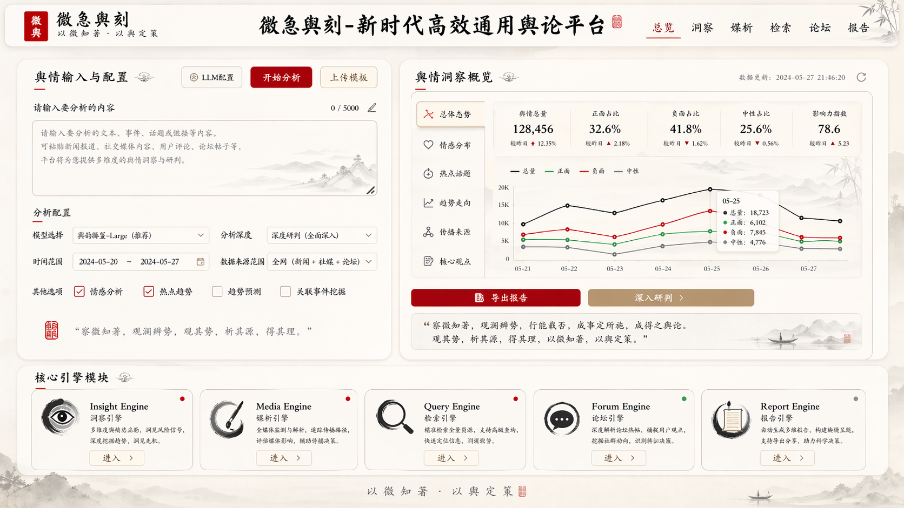
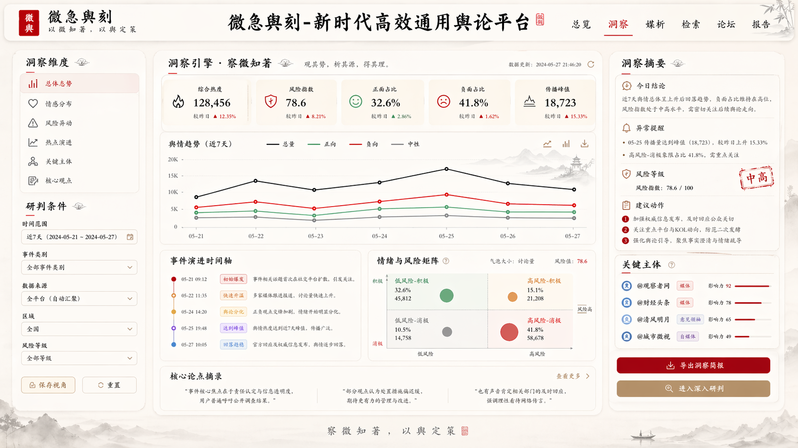
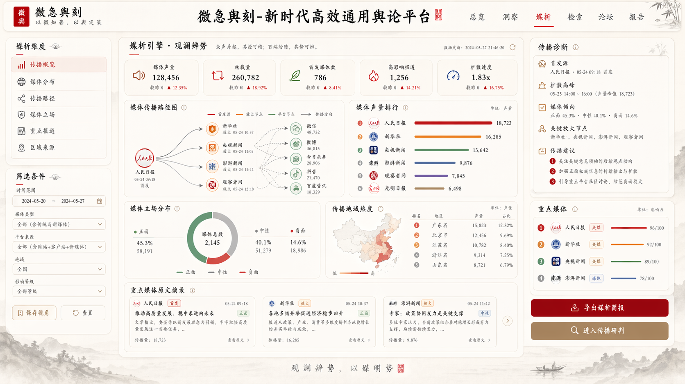
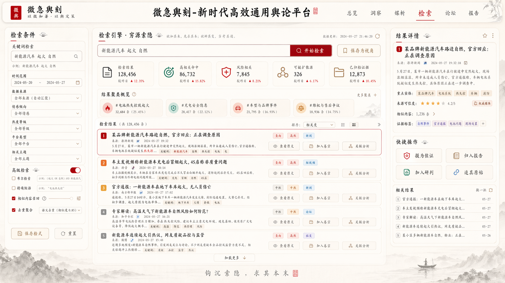
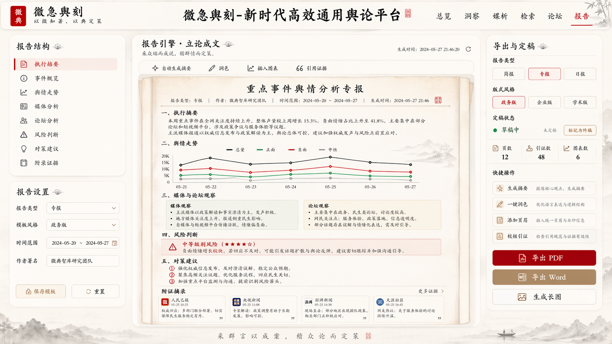
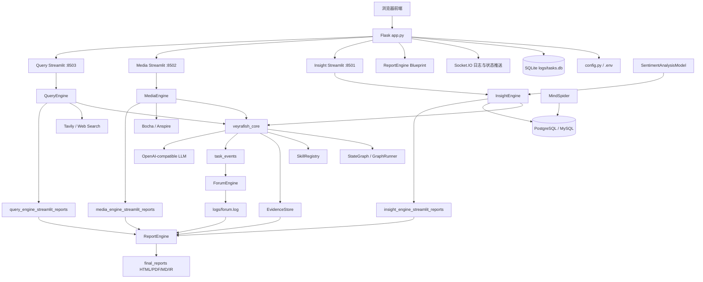
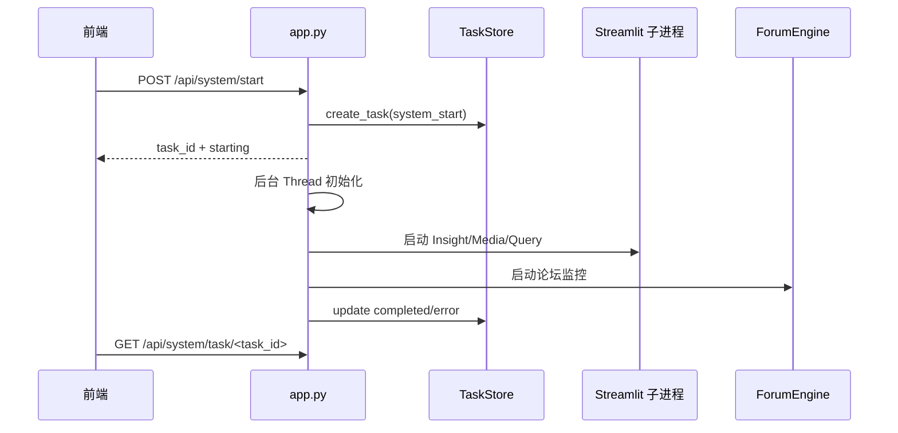
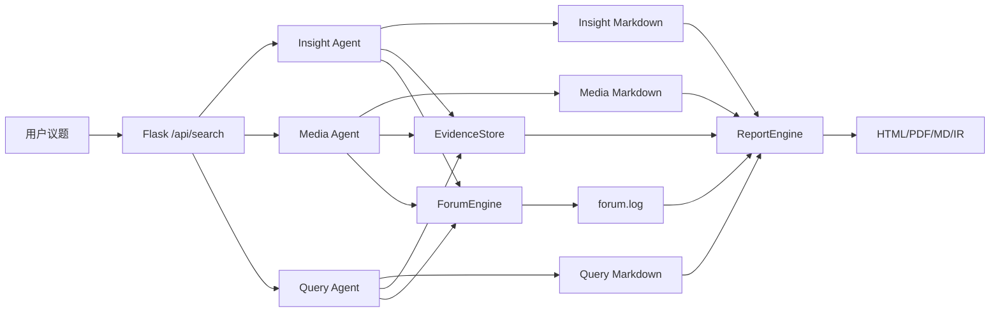

# Veyrafish 整体项目设计文档

**文档版本**：2026-04-24  
**项目名称**：维舆 / Veyrafish  
**项目类型**：多智能体舆情分析、信息检索、社媒数据采集、自动报告生成系统  
**适用对象**：竞赛评委、项目开发者、部署维护人员、后续二次开发者  
**事实边界**：本文基于当前仓库文件、实施日志和源码结构整理。当前目录不是 Git 工作树，因此本文不依赖 `git diff`。

预计最终效果图，名字以**维舆**为准












## 1. 项目概述

Veyrafish 是一个面向舆情分析和多源信息研判的多智能体系统。系统以用户自然语言问题为入口，自动调度多个专业 Agent，从公开网页、多模态搜索结果、本地社媒数据库和论坛协作过程里提取信息，最终生成结构化、可交互、可导出的分析报告。

项目的核心定位不是单一搜索工具，而是“数据采集、信息分析、Agent 协作、证据沉淀、报告生成”一体化工作台。

一句话概括：

**Veyrafish 让用户用一个议题触发多源舆情分析，由多个 Agent 并行研究、互相校准，并输出可追溯的分析报告。**

## 2. 项目背景与问题定义

舆情分析通常面临以下问题：

- 信息源分散：新闻、社媒、评论、短视频、论坛和私有数据分布在不同渠道。
- 数据形态复杂：文本、图片、视频、搜索卡片、评论、结构化指标并存。
- 分析链路长：从采集到分析再到报告，依赖人工整合，效率低。
- 单模型视角有限：单个 LLM 容易受信息不足、观点单一、时效缺失影响。
- 报告复用困难：一次性生成的散文报告难以追踪来源、复盘和再渲染。

Veyrafish 的设计目标是用多智能体分工、论坛协作和结构化报告中间表示解决这些问题。

## 3. 设计目标

### 3.1 产品目标

- 让用户通过一个议题启动完整舆情分析。
- 自动聚合公开网页、多模态搜索、本地社媒数据库和论坛协作信息。
- 输出可阅读、可导出、可答辩展示的综合报告。
- 在前端提供清晰的系统状态、任务进度、Agent 输出和最终成果入口。

### 3.2 工程目标

- 保留原始 Veyrafish 可运行链路。
- 在不大爆炸重构的情况下，逐步引入任务状态层、Agent Runtime、Skill 和 Evidence。
- 让长任务可追踪、可恢复、可回放。
- 让关键能力可测试、可扩展、可演示。

### 3.3 当前阶段目标

当前阶段以竞赛交付为重点：

- 稳定当前 Flask + Streamlit 子进程运行模式。
- 完成“维舆”多页水墨风前端工作台。
- 完成核心 Skill 和 Evidence 资产化。
- 建立固定样例回放和测试基线。
- 为 Docker 调试和正式端到端验收做准备。

## 4. 范围边界

### 4.1 当前已纳入范围

- 主应用 Web 编排。
- 三个分析 Agent：Query、Media、Insight。
- Forum 协作引擎。
- ReportEngine 报告生成引擎。
- MindSpider 数据采集系统。
- SentimentAnalysisModel 情感分析模型集合。
- SQLite 任务状态层。
- `veyrafish_core` Agent Runtime、Skill 和 Evidence。
- 六页前端工作台。
- Docker 与源码启动基础配置。

### 4.2 当前未完全完成范围

- 完整 API-first 重构。
- 完整 Worker 队列架构。
- 浏览器和移动端全面实机验收。
- 完整插件市场。
- 完整评估平台。

## 5. 需求分析

### 5.1 用户角色

| 角色 | 关注点 |
|---|---|
| 普通分析用户 | 输入议题、查看进度、阅读报告 |
| 演示者/答辩者 | 快速展示系统能力、解释架构亮点、展示报告产物 |
| 开发者 | 扩展 Agent、工具、Skill、报告模板、前端页面 |
| 部署维护者 | 配置 API Key、数据库、端口、Docker 和日志 |
| 研究人员 | 回放任务、比较模型和 prompt、评估输出质量 |

### 5.2 功能需求

| 编号 | 功能 | 描述 |
|---|---|---|
| F1 | 系统启动与关闭 | 前端可启动完整系统，后端管理三引擎子进程和 Forum |
| F2 | 配置管理 | 前端可读取/更新 `.env` 中关键 LLM、数据库、搜索配置 |
| F3 | 议题输入 | 用户输入自然语言分析主题 |
| F4 | 多 Agent 分析 | Query、Media、Insight 并行执行专项研究 |
| F5 | 论坛协作 | ForumEngine 聚合 Agent 输出，由主持人生成引导 |
| F6 | 数据采集 | MindSpider 可采集热点新闻、社媒内容和评论 |
| F7 | 情感分析 | Insight 可调用情感分析模型或 Skill 进行情绪判断 |
| F8 | 证据沉淀 | Agent 分析过程可将关键 claim 写入 EvidenceStore |
| F9 | 报告生成 | ReportEngine 汇总三引擎报告和论坛上下文生成综合报告 |
| F10 | 报告导出 | 支持 HTML、PDF、Markdown 和 IR 产物 |
| F11 | 任务状态查询 | 系统启动任务和部分运行事件可通过 TaskStore 查询 |
| F12 | 回放评估 | 固定样例可用于离线回放和质量评估 |

### 5.3 非功能需求

| 类型 | 要求 |
|---|---|
| 可用性 | 配置缺失、启动失败、报告失败应给出明确错误 |
| 可扩展性 | 能扩展新搜索工具、新 Agent、新报告模板、新 Skill |
| 可观测性 | 长任务、节点事件、Forum、Report 进度应可追踪 |
| 可恢复性 | Agent 段落级进度可用于断点恢复 |
| 可测试性 | 核心模型、任务状态、图执行、Skill、Report 清洗应有测试 |
| 兼容性 | 保留原 Flask + Streamlit 子进程模式，不破坏旧路由 |
| 安全性 | API Key 不应硬编码，报告 HTML 需防注入和清洗 |
| 可演示性 | 首页和报告页应能快速表达系统价值 |

## 6. 总体架构

### 6.1 架构分层

```text
用户/浏览器
  ↓
前端页面层：templates + static
  ↓
Web 编排层：app.py / Flask / Socket.IO / Report Blueprint
  ↓
任务状态层：task_store.py / logs/tasks.db
  ↓
Agent Runtime 层：veyrafish_core
  ↓
业务 Agent 层：QueryEngine / MediaEngine / InsightEngine / ForumEngine / ReportEngine
  ↓
数据与外部服务层：数据库 / 搜索 API / LLM API / MindSpider / 情感模型
  ↓
产物层：logs / *_streamlit_reports / final_reports / outputs
```

### 6.2 总体拓扑



### 6.3 当前运行模式

当前系统仍使用“Flask 主进程 + 三个 Streamlit 子进程”的兼容架构：

- Flask 负责主页面、API、Socket.IO、配置、任务状态和进程管理。
- Streamlit 子进程负责三个 Agent 的独立 UI 和自动搜索执行。
- ForumEngine 作为主进程内的监控/协作组件运行。
- ReportEngine 通过 Flask Blueprint 集成。

该模式的优点是迁移风险低，缺点是运行拓扑较复杂、文件协议仍然较多。后续演进方向是 API-first + Worker + 任务状态主通路。

## 7. 技术栈

| 分类 | 技术 |
|---|---|
| Web 框架 | Flask 2.3, Flask-SocketIO |
| 子应用 | Streamlit |
| 配置 | Pydantic Settings, `.env` |
| LLM | OpenAI Python SDK 兼容接口 |
| 搜索 | Tavily, Bocha, Anspire |
| 数据库 | PostgreSQL / MySQL, SQLAlchemy async |
| 任务状态 | SQLite |
| 报告 | Document IR, HTML Renderer, WeasyPrint PDF, Markdown Renderer |
| 爬虫 | MindSpider, Playwright, MediaCrawler 子模块 |
| 机器学习 | PyTorch, Transformers, scikit-learn, sentence-transformers |
| 前端 | Flask 模板、原生 HTML/CSS/JS、Socket.IO、SSE |
| 测试 | pytest |
| 部署 | Dockerfile, docker-compose |

## 8. 模块设计

### 8.1 Web 编排模块：`app.py`

职责：

- 提供六页前端路由。
- 管理 Streamlit 子进程生命周期。
- 初始化数据库和 Forum。
- 转发搜索请求到各引擎子应用。
- 提供配置读写 API。
- 提供系统启动、关闭、状态查询 API。
- 注册 ReportEngine Blueprint。
- 提供 evidence 查询 API。
- 通过 Socket.IO 推送日志和状态。

核心设计点：

- `processes` 字典保存子进程状态。
- `STREAMLIT_SCRIPTS` 定义三个子应用脚本和端口。
- `/api/system/start` 使用后台 Thread 执行，避免请求阻塞。
- `CONFIG_KEYS` 控制前端可编辑的配置项。

### 8.2 配置模块：`config.py`

职责：

- 统一读取 `.env` 和系统环境变量。
- 管理数据库、LLM、搜索 API、Agent 参数。
- 提供 `reload_settings()` 供前端配置热更新后重新加载。
- 对关键默认占位配置给出警告。

配置分组：

- Flask 服务配置。
- 数据库配置。
- Insight / Media / Query / Report / Forum / MindSpider / Keyword Optimizer LLM 配置。
- Tavily / Bocha / Anspire 搜索配置。
- Agent 搜索限制、反思轮次、报告段落限制。

### 8.3 任务状态模块：`task_store.py`

职责：

- 用 SQLite 管理长任务状态。
- 记录节点级事件。
- 与 EvidenceStore 共用 `logs/tasks.db`。
- 提供断点恢复所需的已完成段落查询。
- 启动时清理 zombie tasks。

数据表：

- `tasks`
- `task_events`
- `evidence`

当前定位：

- 已是有效辅助状态层。
- 尚未完全替代文件总线和内存状态。

### 8.4 Core Runtime：`veyrafish_core/`

`veyrafish_core` 是当前项目的架构升级核心。

| 文件/目录 | 职责 |
|---|---|
| `graph.py` | 自研状态图和执行器 |
| `base_research_agent.py` | Query/Media/Insight 共用研究流程 |
| `base_node.py` | 节点抽象 |
| `llm_client.py` | LLM 客户端封装 |
| `dispatcher.py` | 三引擎并发调度 |
| `skill.py` | Skill 基类、上下文和预算 |
| `skills/` | 内部业务 Skill |
| `evidence_store.py` | 共享证据层 |
| `output_models.py` | 结构化输出模型 |
| `replay_eval.py` | 回放评估 |

设计意图：

- 将三引擎重复流程抽象为统一研究框架。
- 用显式状态图替代隐式节点循环。
- 用 Skill 把查询改写、摘要、证据抽取、质量门禁等能力资产化。
- 用 EvidenceStore 支撑报告可追溯。

### 8.5 QueryEngine

职责：

- 面向国内外新闻和网页信息做广度搜索。
- 通过搜索、总结、反思循环生成 Markdown 研究报告。
- 当前主要搜索后端是 Tavily。

核心流程：

1. 规划报告段落。
2. 为每段生成搜索查询。
3. 调用搜索工具。
4. 生成初始总结。
5. 执行多轮反思搜索。
6. 汇总最终报告。

输出：

- `query_engine_streamlit_reports/*.md`
- `logs/query.log`
- 可选 task_events 和 evidence

### 8.6 MediaEngine

职责：

- 面向多模态内容、结构化搜索卡片、网页/图片/视频信息做分析。
- 支持 Bocha 和 Anspire 两种搜索适配。

特点：

- `SEARCH_TOOL_TYPE` 控制搜索后端。
- `AnspireSearchAgent` 作为 `DeepSearchAgent` 的扩展实现。
- 适合补充 QueryEngine 无法覆盖的多模态信息。

输出：

- `media_engine_streamlit_reports/*.md`
- `logs/media.log`
- 可选 task_events 和 evidence

### 8.7 InsightEngine

职责：

- 连接本地舆情数据库，分析社媒内容、评论、热度和情绪。
- 通过关键词优化、聚类采样、情感分析提升数据库检索质量。

数据源：

- `daily_news`
- `daily_topics`
- `bilibili_video`
- `douyin_aweme`
- `kuaishou_video`
- `weibo_note`
- `xhs_note`
- `tieba_note`
- `zhihu_content`
- 以及对应评论表

工具能力：

- 热点内容搜索。
- 全局话题搜索。
- 按日期搜索。
- 获取话题评论。
- 指定平台搜索。
- 情感分析。

输出：

- `insight_engine_streamlit_reports/*.md`
- `logs/insight.log`
- 可选 task_events 和 evidence

### 8.8 ForumEngine

职责：

- 聚合三个 Agent 的阶段性总结。
- 调用论坛主持人 LLM 生成引导性讨论。
- 为后续 Agent 反思和 ReportEngine 汇总提供协作上下文。

双通路设计：

- 文件监听通路：读取 `logs/*.log`，写入 `logs/forum.log`。
- 事件驱动通路：绑定 task_id，读取 `task_events` 中的结构化事件。

当前兼容策略：

- `forum.log` 仍保留，前端和 ReportEngine 可继续使用。
- 新的事件驱动模式用于逐步降低对日志解析的依赖。

### 8.9 ReportEngine

职责：

- 读取三个引擎报告、Forum 日志和可选 evidence。
- 选择合适报告模板。
- 规划文档布局、字数和章节。
- 生成章节 JSON。
- 装订 Document IR。
- 渲染 HTML、PDF、Markdown。

核心子模块：

| 子模块 | 职责 |
|---|---|
| `agent.py` | 报告生成主调度 |
| `flask_interface.py` | API、任务、SSE、下载 |
| `core/template_parser.py` | 模板解析 |
| `core/chapter_storage.py` | 章节存储 |
| `core/stitcher.py` | IR 装订 |
| `ir/schema.py` | IR 块类型和 schema |
| `ir/validator.py` | 章节 JSON 校验 |
| `renderers/html_renderer.py` | HTML 渲染 |
| `renderers/pdf_renderer.py` | PDF 导出 |
| `renderers/markdown_renderer.py` | Markdown 导出 |

ReportEngine API：

- `/api/report/generate`
- `/api/report/progress/<task_id>`
- `/api/report/stream/<task_id>`
- `/api/report/result/<task_id>`
- `/api/report/download/<task_id>`
- `/api/report/export/md/<task_id>`
- `/api/report/export/pdf/<task_id>`
- `/api/report/templates`

### 8.10 MindSpider

职责：

- 从外部平台采集热点新闻、话题和社媒内容。
- 将数据写入本地数据库，供 InsightEngine 查询。

模块：

| 模块 | 职责 |
|---|---|
| `BroadTopicExtraction` | 获取热点新闻，抽取每日话题 |
| `DeepSentimentCrawling` | 基于话题关键词执行深度爬取 |
| `schema` | 数据库模型、建表、DDL |
| `main.py` | CLI 入口 |

关键表：

- `daily_news`
- `daily_topics`
- `topic_news_relation`
- `crawling_tasks`
- 七类平台内容表和评论表

### 8.11 SentimentAnalysisModel

职责：

- 提供多种情感分析方案，支撑 InsightEngine 和未来报告统计。

模型类型：

- 中文 BERT LoRA。
- GPT-2 LoRA。
- 多语言情感分析。
- 小参数 Qwen。
- 传统机器学习模型。

当前定位：

- 作为模型资产集合存在。
- InsightEngine 可通过工具层进行集成。
- 新的 `sentiment_analysis` Skill 已完成第一轮增强，但前端统计展示仍待后续产品接入。

### 8.12 SingleEngineApp

职责：

- 为 Query、Media、Insight 提供独立 Streamlit UI。
- 接收 URL 查询参数触发自动搜索。
- 展示段落、搜索历史、报告结果。

三个入口：

- `SingleEngineApp/insight_engine_streamlit_app.py`
- `SingleEngineApp/media_engine_streamlit_app.py`
- `SingleEngineApp/query_engine_streamlit_app.py`

## 9. 核心业务流程设计

### 9.1 系统启动流程



### 9.2 舆情分析流程



### 9.3 Agent 内部研究流程

每个研究 Agent 的通用流程：

1. 接收用户 query。
2. 使用 `query_rewrite` 或节点逻辑理解意图。
3. 生成报告段落结构。
4. 对每个段落执行初始搜索。
5. 对搜索结果做摘要。
6. 使用 `quality_gate` 判断摘要是否足够。
7. 使用 `gap_finder` 或反思节点判断缺口。
8. 进行多轮反思搜索。
9. 使用 `evidence_extract` 沉淀证据。
10. 生成最终 Markdown 报告。
11. 写入任务事件和日志。

### 9.4 报告生成流程

1. 检查三引擎报告是否就绪。
2. 读取最新 Markdown 报告。
3. 读取 `forum.log`。
4. 可选读取 EvidenceStore 聚合结果。
5. 选择报告模板。
6. 规划标题、目录、主题和篇幅。
7. 逐章节生成 JSON。
8. 校验章节结构。
9. 装订 Document IR。
10. 渲染 HTML。
11. 支持导出 PDF 和 Markdown。

## 10. 数据设计

### 10.1 数据存储总览

| 存储 | 位置 | 用途 |
|---|---|---|
| 业务数据库 | PostgreSQL/MySQL | MindSpider 采集内容、Insight 查询 |
| SQLite | `logs/tasks.db` | 任务、事件、证据 |
| 日志文件 | `logs/*.log` | 运行日志、Forum 兼容协议 |
| 引擎报告 | `*_streamlit_reports/*.md` | 三引擎中间结果 |
| 最终报告 | `final_reports/` | HTML、IR、PDF、Markdown |
| 回放产物 | `outputs/` | runtime、评估和治理收据 |

### 10.2 业务数据库设计

MindSpider 扩展表：

| 表 | 用途 |
|---|---|
| `daily_news` | 每日热点新闻 |
| `daily_topics` | LLM 抽取的每日话题 |
| `topic_news_relation` | 话题与新闻关联 |
| `crawling_tasks` | 爬取任务记录 |

社媒内容表：

| 平台 | 内容表 | 评论表 |
|---|---|---|
| B站 | `bilibili_video` | `bilibili_video_comment` |
| 抖音 | `douyin_aweme` | `douyin_aweme_comment` |
| 快手 | `kuaishou_video` | `kuaishou_video_comment` |
| 微博 | `weibo_note` | `weibo_note_comment` |
| 小红书 | `xhs_note` | `xhs_note_comment` |
| 贴吧 | `tieba_note` | `tieba_comment` |
| 知乎 | `zhihu_content` | `zhihu_comment` |

### 10.3 SQLite 任务状态设计

`tasks`：

```json
{
  "task_id": "uuid",
  "task_type": "system_start",
  "status": "pending|running|completed|error",
  "created_at": "iso datetime",
  "updated_at": "iso datetime",
  "payload": {},
  "result": {}
}
```

`task_events`：

```json
{
  "event_id": "uuid",
  "task_id": "uuid",
  "event_type": "node_start|node_done|paragraph_done|research_done|error",
  "node_name": "FirstSummaryNode",
  "paragraph": 0,
  "detail": {}
}
```

`evidence`：

```json
{
  "task_id": "uuid",
  "engine": "query|media|insight",
  "paragraph_index": 0,
  "claim": "结构化判断",
  "source": "来源",
  "confidence": 0.8,
  "metadata": {}
}
```

### 10.4 Document IR

Document IR 是报告内容和渲染之间的中间层：

```json
{
  "documentId": "report-xxx",
  "meta": {
    "title": "报告标题",
    "toc": [],
    "themeTokens": {}
  },
  "chapters": [
    {
      "chapterId": "S1",
      "title": "执行摘要",
      "anchor": "section-1",
      "order": 10,
      "blocks": []
    }
  ]
}
```

支持块类型包括标题、段落、列表、表格、SWOT、PEST、引用、Agent 引用、提示框、KPI、图表、代码、数学公式、组件、目录和分隔线。

### 10.5 Forum 日志协议

`forum.log` 行格式：

```text
[HH:MM:SS] [SOURCE] content
```

`SOURCE` 包括：

- `SYSTEM`
- `QUERY`
- `MEDIA`
- `INSIGHT`
- `HOST`

该协议是当前前端和 ReportEngine 兼容链路的一部分，后续应逐渐由 `task_events` 替代其主通路地位。

## 11. API 设计

### 11.1 页面 API

| 路由 | 说明 |
|---|---|
| `GET /` | 总览页 |
| `GET /insight` | 洞察页 |
| `GET /media` | 媒析页 |
| `GET /query` | 检索页 |
| `GET /forum` | 论坛页 |
| `GET /report` | 报告页 |

### 11.2 系统 API

| 路由 | 方法 | 说明 |
|---|---|---|
| `/api/status` | GET | 子应用状态 |
| `/api/system/status` | GET | 系统启动状态 |
| `/api/system/start` | POST | 后台启动完整系统 |
| `/api/system/task/<task_id>` | GET | 查询启动任务 |
| `/api/system/tasks` | GET | 查询最近启动任务 |
| `/api/system/shutdown` | POST | 优雅关闭 |
| `/api/start/<app_name>` | GET | 启动单个子应用 |
| `/api/stop/<app_name>` | GET | 停止单个子应用 |
| `/api/output/<app_name>` | GET | 获取日志输出 |

### 11.3 业务 API

| 路由 | 方法 | 说明 |
|---|---|---|
| `/api/search` | POST | 向三引擎转发搜索 |
| `/api/config` | GET/POST | 配置读取和更新 |
| `/api/evidence/<task_id>` | GET | 证据查询 |
| `/api/forum/log` | GET | 获取 Forum 日志 |
| `/api/forum/log/history` | POST | 获取历史 Forum 日志 |
| `/api/forum/start` | GET | 启动 Forum |
| `/api/forum/stop` | GET | 停止 Forum |

### 11.4 Report API

| 路由 | 方法 | 说明 |
|---|---|---|
| `/api/report/status` | GET | 报告引擎状态 |
| `/api/report/generate` | POST | 创建报告生成任务 |
| `/api/report/progress/<task_id>` | GET | 查询报告进度 |
| `/api/report/stream/<task_id>` | GET | SSE 进度流 |
| `/api/report/result/<task_id>` | GET | 获取 HTML 结果 |
| `/api/report/result/<task_id>/json` | GET | 获取 JSON 结果 |
| `/api/report/download/<task_id>` | GET | 下载 HTML 报告 |
| `/api/report/cancel/<task_id>` | POST | 取消报告任务 |
| `/api/report/export/md/<task_id>` | GET | 导出 Markdown |
| `/api/report/export/pdf/<task_id>` | GET | 导出 PDF |
| `/api/report/templates` | GET | 获取模板列表 |

## 12. 前端设计

### 12.1 页面结构

当前前端采用 Flask 模板多页结构：

- `index.html`：总览页。
- `insight.html`：洞察引擎页。
- `media.html`：媒析引擎页。
- `query.html`：检索引擎页。
- `forum.html`：论坛页。
- `report.html`：报告页。

共享资源：

- `static/engine-shared.css`
- `static/engine-shared.js`
- `static/veyu-ui.css`
- `templates/assets/svg_assets/`
- `templates/assets/png/`

### 12.2 交互设计

主要交互：

- 输入议题。
- 上传报告模板。
- 打开配置弹窗。
- 启动系统。
- 查看引擎状态。
- 进入五个专项页面。
- 查看 Forum 消息。
- 创建报告任务。
- 通过 SSE 查看报告进度。
- 导出 HTML/PDF/Markdown。

### 12.3 视觉设计

视觉关键词：

- 新中式。
- 水墨。
- 宣纸。
- 朱砂印章。
- 山水、小舟、竹子、云纹。
- 黑白灰工作台底色。

设计原则：

- 视觉服务于分析工作，不遮挡日志、按钮、报告和配置。
- 系统运维入口收纳到系统菜单。
- 首页第一屏突出品牌、议题输入和引擎入口。
- 演示态 KPI/图表要与真实数据态保持区分。

## 13. Agent、Skill 与 Evidence 设计

### 13.1 Agent 分工

| Agent | 侧重点 |
|---|---|
| Query Agent | 公开网页和新闻信息广度 |
| Media Agent | 多模态、视频/图片/结构化卡片 |
| Insight Agent | 私有社媒数据库、评论、情绪 |
| Forum Host | 汇总、质疑、引导、校准 |
| Report Agent | 综合报告生成和渲染 |

### 13.2 Skill 分层

| 层级 | Skill | 说明 |
|---|---|---|
| 核心 | `query_rewrite` | 搜索意图改写、工具/平台/时间约束 |
| 核心 | `llm_summarize` | 摘要和增量总结 |
| 核心 | `evidence_extract` | 证据抽取和缺口识别 |
| 核心 | `quality_gate` | 输出质量门禁 |
| 增强 | `gap_finder` | 覆盖、冲突、时效缺口 |
| 增强 | `sentiment_analysis` | 情感判断与统计 |
| 适配 | `web_search` | 搜索 provider 适配 |

### 13.3 Evidence 设计

Evidence 的价值：

- 把报告中的关键判断和来源绑定。
- 支撑 ReportEngine 获取更结构化的上下文。
- 为后续前端“证据面板”“冲突提示”“可信度统计”提供数据基础。
- 为回放评估提供依据。

当前限制：

- BaseResearchAgent 的 evidence sink 仍有轻量启发式成分。
- `EvidenceExtractSkill` 与 evidence sink 的深度集成仍可继续加强。

## 14. 部署设计

### 14.1 源码启动

基础流程：

1. 创建 Python 3.11 环境。
2. 安装依赖。
3. 配置 `.env`。
4. 准备数据库。
5. 启动 `python app.py`。
6. 访问 `http://localhost:5000`。

相关端口：

| 服务 | 端口 |
|---|---|
| Flask 主应用 | 5000 |
| Insight Streamlit | 8501 |
| Media Streamlit | 8502 |
| Query Streamlit | 8503 |
| PostgreSQL Docker 默认映射 | 5444 -> 5432 |

### 14.2 Docker 部署

项目提供：

- `Dockerfile`
- `docker-compose.yml`
- `docker-compose.local.yml`

设计目标：

- 应用容器运行 Flask 和子应用。
- 数据库容器运行 PostgreSQL。
- 挂载 `.env`、`logs`、`final_reports`、报告目录。

当前状态：

- Docker 配置存在。
- 正式 Docker 验收尚未完成。
- Docker 阶段应单独记录环境变量、端口、数据卷和依赖问题。

### 14.3 目录产物

| 目录 | 用途 |
|---|---|
| `logs/` | 日志、任务库 |
| `final_reports/` | 最终报告 |
| `query_engine_streamlit_reports/` | Query 中间报告 |
| `media_engine_streamlit_reports/` | Media 中间报告 |
| `insight_engine_streamlit_reports/` | Insight 中间报告 |
| `outputs/` | runtime、回放、治理产物 |

## 15. 测试与验收

### 15.1 测试分层

| 层级 | 内容 |
|---|---|
| 单元测试 | TaskStore、Graph、Skill、IR 清洗、Forum 解析 |
| 契约测试 | Skill 输入输出、Agent 输出、Report IR |
| 集成测试 | Graph + BaseResearchAgent + Skill 主路径 |
| 回放测试 | 固定样例输入和评分 |
| 手工验收 | 浏览器六页、启动、搜索、Forum、Report 导出 |
| Docker 验收 | 容器启动、端口、数据库、完整流程 |

### 15.2 当前测试证据

已有实施日志记录：

- Phase 1：`pytest 61/61` 通过。
- Phase 2：图执行、Skill、集成测试通过记录。
- Phase 2.5：固定样例、离线回放、评分闭环已建立。

当前仍需补：

- 当前会话未重新执行全量 pytest。
- 浏览器实机验收未完成。
- Docker 正式验收未完成。
- 真实 LLM live replay 未通过。

### 15.3 手工验收清单

- 打开 `/`，确认品牌、输入、五引擎入口、系统菜单正常。
- 打开 `/insight`、`/media`、`/query`，确认 iframe 或占位态正常。
- 打开 `/forum`，确认消息刷新、历史记录正常。
- 打开 `/report`，确认报告生成按钮、进度、预览和下载入口正常。
- 使用缺失 API Key 配置，确认错误提示可理解。
- 检查 `final_reports/` 是否生成 HTML/IR/PDF/MD。

## 16. 安全与合规设计

### 16.1 API Key 与配置安全

- API Key 通过 `.env` 管理。
- 前端配置界面支持编辑关键配置，但需避免在展示层明文泄露。
- 不应将真实密钥提交到代码仓库。

### 16.2 数据安全

- InsightEngine 对数据库以查询为主。
- MindSpider 写入采集数据。
- 业务数据库应按部署环境配置账号权限。
- 报告输出可能包含敏感信息，部署时应限制访问路径。

### 16.3 内容安全

- ReportEngine 已有 HTML 输出清洗和 IR 校验相关测试。
- 报告生成需防止脚本注入、恶意链接和不可信 HTML 原样渲染。

### 16.4 合规声明

项目包含爬虫和舆情分析能力，仅适合学习、研究和合规场景。实际使用时需要遵守平台 robots、用户协议、数据隐私和当地法律法规。

## 17. 可扩展性设计

### 17.1 新增搜索工具

扩展点：

- `QueryEngine/tools/`
- `MediaEngine/tools/`
- `veyrafish_core/skills/web_search.py`
- `config.py` 新增 API Key 和 provider 配置。

### 17.2 新增 Agent

步骤：

1. 新建 Engine 目录。
2. 复用 `BaseResearchAgent`。
3. 添加 Streamlit 壳。
4. 在 `app.py` 注册脚本、端口和状态。
5. 在 Forum 和 Report 输入处注册新输出。

### 17.3 新增 Report 块类型

步骤：

1. 修改 `ReportEngine/ir/schema.py`。
2. 修改 validator。
3. 修改 HTML/PDF/Markdown renderer。
4. 修改章节生成 prompt。
5. 添加 IR 示例和测试。

### 17.4 新增 Skill

步骤：

1. 在 `_models.py` 定义输入输出 schema。
2. 实现 `Skill` 子类。
3. 在 registry 中注册。
4. 写 spec 文档。
5. 写单元测试和 fallback 测试。

## 18. 当前风险

| 风险 | 说明 | 建议 |
|---|---|---|
| 文件总线仍是关键通路 | Report 和 Forum 仍依赖 Markdown/log 文件 | 逐步迁移到 task/evidence/event 状态层 |
| 前端历史包袱大 | `index.html` 体量巨大，旧脚本兼容复杂 | 继续拆分 JS/CSS，建立页面组件规范 |
| Evidence 质量不稳定 | 证据抽取仍需更强 schema 和来源绑定 | 深接 EvidenceExtractSkill |
| 配置复杂 | 多 Agent 多 provider，用户容易配错 | 增加启动自检和配置向导 |
| 子进程架构脆弱 | Flask 管 Streamlit 进程适合演示，不够生产 | 后续迁移 Worker/API-first |
| 爬虫合规风险 | 采集社媒数据需遵守平台规则 | 文档明确合规边界，部署时加开关 |

## 19. 风险与演进路线

### 19.1 近期路线：演示稳定

- 重新运行全量测试。
- 浏览器实机检查六页。
- 修复静态资源和前端布局问题。
- 完成最小真实任务演示。
- 完成 Docker 调试准备清单。

### 19.2 中期路线：状态层主通路

- `/api/search` 改为创建 research task。
- 三引擎任务 id 全链路贯通。
- Forum 优先消费 `task_events`。
- Report 优先消费 task/evidence。
- 文件输出降级为兼容和归档。

### 19.3 中期路线：前端产品化

- 最近任务。
- 最近报告。
- Evidence 面板。
- Skill 调试面板。
- 真实 KPI 和图表数据接入。
- 移动端基础适配。

### 19.4 长期路线：平台化

- FastAPI API-first。
- Worker 队列。
- 插件化模板、工具和 Agent。
- 完整评估回放系统。
- OpenTelemetry 可观测性。
- 权限、审计和团队协作。

## 20. 当前完成度判定

当前项目的准确完成度应描述为：

- **系统原始能力**：已有完整链路，能表达多智能体舆情分析产品形态。
- **工程治理**：核心治理已建立，但仍需干净环境和契约测试补齐。
- **运行架构**：任务状态层和长任务抽离已完成核心改造，但文件总线未完全降级。
- **Agent Runtime**：代码主路径和测试门禁已有基础，正式真实环境验收未完成。
- **前端产品化**：多页水墨工作台已静态落地，浏览器/移动端和真实数据联调未完成。
- **报告能力**：ReportEngine 已较成熟，是当前最完整的产品化能力。
- **部署验收**：Docker 和真实 LLM 联调仍是下一阶段重点。

## 21. 总结

Veyrafish 的整体设计可以理解为一个“多智能体舆情分析操作系统”的雏形：底层有爬虫和数据库，中层有多 Agent、Skill、Evidence 和 Forum 协作，上层有 ReportEngine 和维舆工作台。当前项目已经不只是一个脚本集合，而是具备明确工程边界和产品表达的系统。

下一阶段最重要的不是继续堆新功能，而是把当前已经形成的主链路做实：启动可复现、任务可追踪、证据可查询、报告可稳定生成、Docker 可部署、演示可控。完成这些后，项目才适合继续向 API-first、Worker、插件化和评估平台演进。

