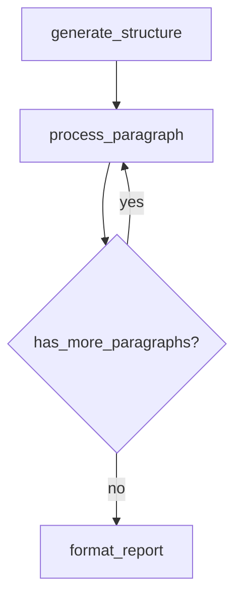

# Wave 3：三引擎图谱化迁移

**所属**：Phase 2 二阶段架构升级  
**前置**：Wave 1（StateGraph）+ Wave 2（Skill Registry）  
**产出**：`BaseResearchAgent` 重构 + `tests/test_graph_integration.py`

---

## 1. 目标

把 Insight / Media / Query 三引擎的 `research()` 流程从 `BaseResearchAgent` 中的 **硬编码方法调用链** 迁移到 **StateGraph 驱动的显式图执行**。

迁移后，三引擎子类（`DeepSearchAgent` 等）**不需要修改**——图的节点绑定通过已有的 `_initialize_nodes()` 完成。

## 2. 当前架构 vs 目标架构

### 当前（硬编码调用链）

```python
# BaseResearchAgent.research()
def research(self, query, ...):
    self._generate_report_structure(query)     # 写死调用
    self._process_paragraphs(task_id, ...)     # 写死循环
    report = self._generate_final_report(...)  # 写死调用
    self._save_report(report)
```

### 目标（StateGraph 驱动）

```python
# BaseResearchAgent._build_graph() → StateGraph
def _build_graph(self) -> StateGraph:
    g = StateGraph("research")
    g.add_node("generate_structure", self._node_generate_structure)
    g.add_node("process_paragraph", self._node_process_paragraph)
    g.add_node("check_paragraphs", self._node_check_paragraphs)
    g.add_node("format_report", self._node_format_report)
    
    g.set_entry("generate_structure")
    g.add_edge("generate_structure", "process_paragraph")
    g.add_conditional_edge("process_paragraph", 
        condition=self._has_more_paragraphs,
        targets={"yes": "process_paragraph", "no": "format_report"})
    g.set_finish("format_report")
    return g

# BaseResearchAgent.research()
def research(self, query, ...):
    graph = self._build_graph()
    runner = GraphRunner(graph, task_store=self._get_task_store())
    state = self._create_initial_state()
    state.query = query
    final_state = runner.run(state, task_id=task_id)
    if save_report:
        self._save_report(final_state.report_content)
    return final_state.report_content
```

## 3. 关键设计决策

### 3.1 节点函数签名统一

每个节点函数接收 `GraphState` 并返回修改后的 `GraphState`：

```python
def _node_generate_structure(self, state: GraphState) -> GraphState:
    """对应原来的 _generate_report_structure()"""
    # 调用现有 ReportStructureNode
    # 更新 state.paragraphs
    return state
```

这意味着我们**复用现有 Node 类**（FirstSearchNode 等），只是把它们包裹进图节点函数。

### 3.2 段落循环的图表达

当前 `_process_paragraphs` 是一个 for 循环。在图中用**条件边自循环**表达：

```
process_paragraph → [has_more?] → yes → process_paragraph
                                → no  → format_report
```

`state` 中维护 `current_paragraph_index`，每次 `process_paragraph` 执行完后 +1。

### 3.3 反思循环的图表达

当前 `_reflection_loop` 是内嵌在段落处理中的 while 循环。

两种方案：
- **方案 A（推荐）**：反思循环作为 `process_paragraph` 节点的**内部逻辑**，不暴露到顶层图
- **方案 B**：反思循环也展开为顶层图节点

推荐方案 A，因为：
- 顶层图保持简洁（4-5 个节点）
- 反思循环的迭代次数由 `MAX_REFLECTIONS` 控制，不需要图级别的可见性
- 如果后续需要更细粒度控制，可以把反思展开为子图（subgraph）

### 3.4 向后兼容

- 保留 `_research_legacy()` 作为旧实现的备份
- 通过 `USE_GRAPH_ENGINE` 配置开关切换（默认 True）
- 子类的 `_initialize_nodes()` / `execute_search_tool()` 等抽象方法接口不变

### 3.5 子类可覆盖图结构

```python
class DeepSearchAgent(BaseResearchAgent):
    def _build_graph(self) -> StateGraph:
        # 如果 InsightEngine 需要额外的图节点（如聚类），可以 override
        graph = super()._build_graph()
        # graph.add_node("clustering", self._node_clustering)
        return graph
```

## 4. 任务分解

| 编号 | 任务 | 文件 |
|------|------|------|
| W3.1 | 提取节点包裹函数（`_node_generate_structure` / `_node_process_paragraph` / `_node_format_report`） | `veyrafish_core/base_research_agent.py` |
| W3.2 | 实现 `_build_graph()` 默认图定义 | `veyrafish_core/base_research_agent.py` |
| W3.3 | 重构 `research()` 使用 `GraphRunner.run()` | `veyrafish_core/base_research_agent.py` |
| W3.4 | 重构 `research_with_resume()` 使用 `GraphRunner.resume()` | `veyrafish_core/base_research_agent.py` |
| W3.5 | 保留 `_research_legacy()` + 配置开关 | `veyrafish_core/base_research_agent.py` |
| W3.6 | 验证三引擎子类无需修改 | `InsightEngine/agent.py` + `MediaEngine/agent.py` + `QueryEngine/agent.py`（只做验证，不改动） |
| W3.7 | 集成测试（mock LLM + mock 搜索） | `tests/test_graph_integration.py` |

预估改动量：**修改 ~200 行（BaseResearchAgent）+ 新增 ~150 行测试**

## 5. 测试计划

```python
# tests/test_graph_integration.py

class TestResearchGraphIntegration:
    def test_linear_research_flow(self): ...
    def test_multi_paragraph_loop(self): ...
    def test_reflection_within_paragraph(self): ...
    def test_resume_skips_completed_paragraphs(self): ...
    def test_legacy_mode_still_works(self): ...
    def test_task_events_from_graph_runner(self): ...
    def test_subclass_can_override_graph(self): ...
```

## 6. 验证门禁

```bash
pytest tests/test_graph_integration.py -v  # 图谱化流程通过
pytest tests/ -q                           # 全量无回归
```

## 7. 回滚方式

- `_research_legacy()` 保留旧实现
- 配置 `USE_GRAPH_ENGINE=False` 回退到旧流程
- 三引擎子类不受影响

## 8. 迁移后的图结构（Mermaid）



每个 `process_paragraph` 内部包含：
```
FirstSearchNode → FirstSummaryNode → [ReflectionNode → ReflectionSummaryNode] × N
```
