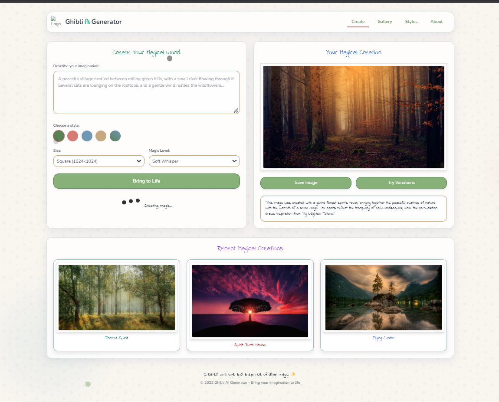
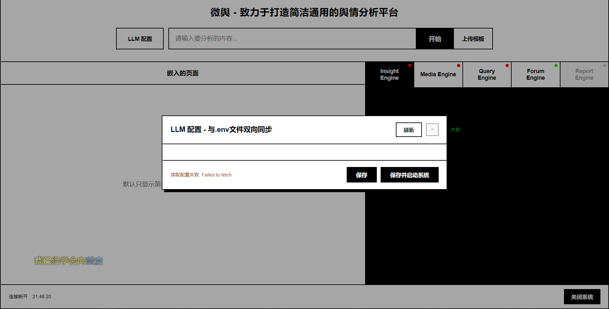
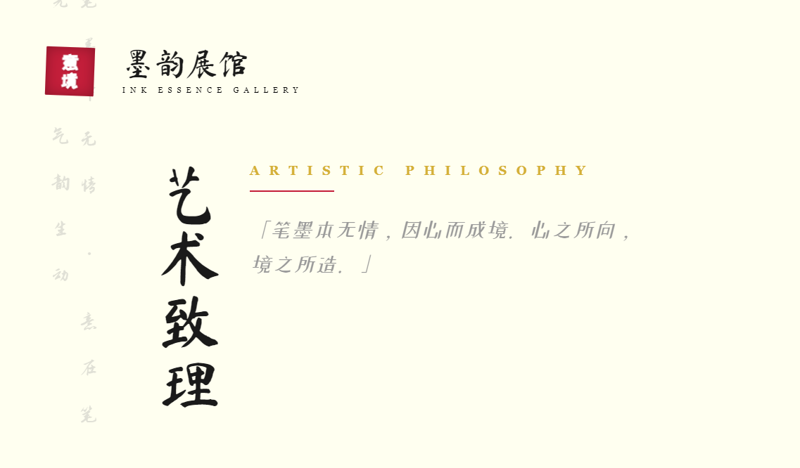
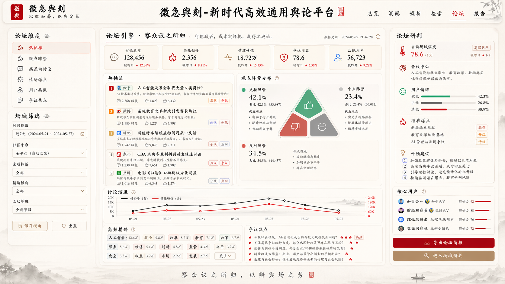

# 微急舆刻UI重构

**User:**   
**Created:** 4/21/2026 21:47:59  
**Updated:** 4/22/2026 10:50:21  
**Exported:** 4/22/2026 12:11:20  
**Link:** [https://chatgpt.com/g/g-p-69e77e6aa4588191ad40218888b53a80/c/69e77fac-1ac8-83e8-80d2-3ae5e7d10a57](https://chatgpt.com/g/g-p-69e77e6aa4588191ad40218888b53a80/c/69e77fac-1ac8-83e8-80d2-3ae5e7d10a57)  

## Prompt:
4/21/2026, 9:47:57 PM

你知道那个betafish，微舆么，除了整体架构升级，另外还需要重构ui设计，大标题改为“微急舆刻-新时代高效通用舆论平台”，然后布局改成像图片这样子，功能和功能键都位置都改成这样位置。另外文字这边我想古文风一点，字体用上图三，例如什么“行能臧否，或素定怀抱，或得之舆论”这种古文风

## Response:
4/21/2026, 9:47:59 PM

## Prompt:
4/22/2026, 10:42:17 AM

这张展示总览的效果已经很不错了，但是点击进去各个引擎（同时也是右上角的），这里的界面是怎么样的

## Response:
4/22/2026, 10:42:17 AM

> **Describing the interface and navigation layout**
>
> The user seems to want a conceptual description of the interface, particularly how the layout looks when navigating to different engines via the top-right navigation. I’ll describe the page modules and key regions, such as the Overview, Insights, Media, Query, Forum, and Report pages. I’ll also explain the interactions and structure for each, especially related to top navigation.
>
> Thought for 16s

可以，而且这一步其实很关键：**总览页负责“观全局”，各引擎内页负责“做深做专”**。  
我建议它们都沿用现在这套国风 SaaS 视觉，但**结构更聚焦、操作更重、信息密度更高**。

你这个体系里，右上角导航和底部五个引擎卡，最好一一对应成 5 个内页：

**洞察 = Insight Engine**  
**媒析 = Media Engine**  
**检索 = Query Engine**  
**论坛 = Forum Engine**  
**报告 = Report Engine**

整体上，进入内页后，页面骨架建议统一成：

**顶部**：保留同一套页眉、品牌、右上导航  
**左侧**：筛选 / 子功能导航  
**中间**：主工作区  
**右侧**：摘要、评分、快捷操作  
**底部**：明细列表 / 时间线 / 原文卡片

这样用户一进去不会“换系统”，只是从“总览”切到“专页”。

* * *

一、洞察引擎 Insight Engine
---------------------

这是最像“主分析台”的页面，偏大盘与研判。

### 页面气质

题头可以写成：

**洞察引擎 · 察微知著**  
副句：**“观其势，析其源，得其理。”**

### 布局

左侧做一列“洞察维度”切换：

*   总体态势
*   情感分布
*   风险异动
*   热点演进
*   关键主体
*   核心观点

中间是主图区，重点放：

*   舆情趋势折线图
*   正负中性占比
*   风险热度波动
*   事件阶段演进轴

右侧是“洞察摘要”卡：

*   今日结论
*   异常提醒
*   风险等级
*   建议动作

底部是“事件脉络”与“核心论点摘录”。

### 进入后的感觉

就是从总览页右上那个“舆情洞察概览”，**展开成一个完整作战页**。  
总览页看到的是“缩略图”，洞察页看到的是“全尺寸分析台”。

* * *

二、媒析引擎 Media Engine
-------------------

这个页面主打“媒体传播链路”和“媒体态度画像”。

### 页面气质

标题可用：

**媒析引擎 · 观澜辨势**  
副句：**“众声并起，其源可稽；百端纷陈，其势可辨。”**

### 布局

左侧是媒体筛选：

*   新闻媒体
*   社交平台
*   视频平台
*   自媒体
*   海外媒体
*   地域来源

中间主区域建议做成上下两层：

上层：

*   传播路径图
*   首发媒体 / 扩散节点
*   媒体声量排行
*   转载链路图

下层：

*   媒体立场分布
*   正负倾向图
*   重点媒体原文卡片
*   媒体影响力评分

右侧做“传播诊断”：

*   首发源
*   扩散高峰
*   媒体倾向
*   关键放大节点
*   传播建议

### 视觉重点

这一页比总览更适合有“传播地图”“节点连线”“媒体列表卡片”。  
会更像“舆论传播剖面图”。

* * *

三、检索引擎 Query Engine
-------------------

这是最工具化的一页，要让用户感觉“快、准、深”。

### 页面气质

标题可以写：

**检索引擎 · 穷源索隐**  
副句：**“欲知其来，先求其本；欲辨其变，当考其迹。”**

### 布局

顶部直接就是一个很强的搜索区：

*   主搜索框
*   时间范围
*   平台来源
*   情感倾向
*   热度等级
*   高级检索开关

中间是结果区，两栏或三栏都可以。

左中主列表：

*   搜索结果卡片
*   标题 / 摘要 / 来源 / 时间
*   命中关键词高亮
*   情感标签 / 风险标签

右侧详情面板：

*   选中文章全文预览
*   相关事件
*   相似内容
*   来源可信度
*   一键加入报告 / 一键加入研判

### 关键体验

这页最好像“古风版高级搜索平台”，不是普通列表。  
要体现：

*   支持布尔检索
*   支持话题交叉过滤
*   支持相似文本召回
*   支持证据留存

### 文案风格

按钮可以不用太白话，比如：

*   **检而索之**
*   **援为佐证**
*   **归入卷宗**
*   **追其原帖**

* * *

四、论坛引擎 Forum Engine
-------------------

这是最有“舆论场”感觉的一页，重点不是媒体，而是**网民讨论、观点对立、情绪扩散**。

### 页面气质

标题建议：

**论坛引擎 · 察众议之所归**  
副句：**“行能臧否，或素定怀抱，或得之舆论。”**

这句就很适合放这里。

### 布局

左侧为论坛/社区维度：

*   热帖榜
*   观点阵营
*   高互动讨论
*   情绪爆点
*   用户画像
*   争议焦点

中间主区分三块：

第一块：热帖流

*   热帖卡片瀑布流或列表
*   回复数、转发数、点赞数
*   情绪倾向色标

第二块：观点阵营图

*   支持 / 反对 / 观望
*   代表论点
*   高频措辞

第三块：讨论演进

*   话题发酵时间线
*   情绪峰值节点
*   突发转折点

右侧做“论坛研判”：

*   当前场域温度
*   争议中心
*   用户情绪
*   潜在爆点
*   干预建议

### 视觉重点

这一页可以更“动态”，信息更密，但仍然要雅。  
比如卡片标题下方用小篆风标签，配轻红轻墨色标，不要做成互联网论坛那种嘈杂感。

* * *

五、报告引擎 Report Engine
--------------------

这是最偏“输出成果”的页面，要有“卷轴、定稿、归档”的气质。

### 页面气质

标题建议：

**报告引擎 · 立论成文**  
副句：**“采众端而成说，稽群情而定策。”**

### 布局

左侧放“报告结构树”：

*   执行摘要
*   事件概览
*   舆情走势
*   媒体分析
*   论坛分析
*   风险判断
*   对策建议
*   附录证据

中间是报告编辑预览区，像“文卷”：

*   大段正文排版
*   图表嵌入
*   重点摘要框
*   引证原文折叠块

右侧是“导出与定稿”：

*   报告类型：简报 / 专报 / 日报 / 周报 / 专题报告
*   风格模板：政务版 / 企业版 / 学术版
*   一键生成摘要
*   一键润色
*   导出 PDF / Word / 长图

### 这页的核心体验

不是分析，而是**把前四页的分析成果汇成可交付物**。  
所以这页最适合做得沉稳、留白多、文本更有仪式感。

* * *

六、右上角导航怎么和各引擎对应
---------------

我建议你直接这样对应，最顺：

*   **总览**：总控首页
*   **洞察**：Insight Engine
*   **媒析**：Media Engine
*   **检索**：Query Engine
*   **论坛**：Forum Engine
*   **报告**：Report Engine

也就是说，**右上角不是“另一个菜单”**，而是**底部引擎卡的顶层导航化**。  
这样用户理解成本最低。

* * *

七、内页和总览页的关系
-----------

最自然的逻辑应该是：

**总览页**  
看全局、看摘要、看趋势、快速跳转

**引擎内页**  
看专项、看证据、看细节、做操作、出结果

换句话说：

*   总览页是“殿前总览”
*   引擎页是“分署治事”

这很符合你现在想要的那种古雅语境。

* * *

八、古文风文案可以怎么铺
------------

你提的方向很对，但建议**古雅，不要太生僻**。  
适合放在各页标题下或摘要区的小句子，可以这样配：

### 洞察页

**察微知著，观澜辨势。**

### 媒析页

**众声杂遝，而源流可辨。**

### 检索页

**钩沉索隐，求其本末。**

### 论坛页

**行能臧否，或素定怀抱，或得之舆论。**

### 报告页

**采群言以成案，稽众论而定策。**

* * *

九、我建议的下一步
---------

下一步最适合直接补 5 张内页高保真图：

1.  洞察引擎页
2.  媒析引擎页
3.  检索引擎页
4.  论坛引擎页
5.  报告引擎页

我建议先出 **“洞察引擎”** 和 **“报告引擎”** 两张，因为这两页最能把整体产品气质立住。

## Prompt:
4/22/2026, 10:44:05 AM

分别给出统一风格的效果图

## Response:
4/22/2026, 10:44:07 AM

Thinking

Generating a more detailed image — hang tight.

---
Powered by [ChatGPT Exporter](https://www.chatgptexporter.com)