# index.html

2.index.html这里的内容出现大问题，完全不对，这些是ai工具留下的记录，而不是效果图里面的内容

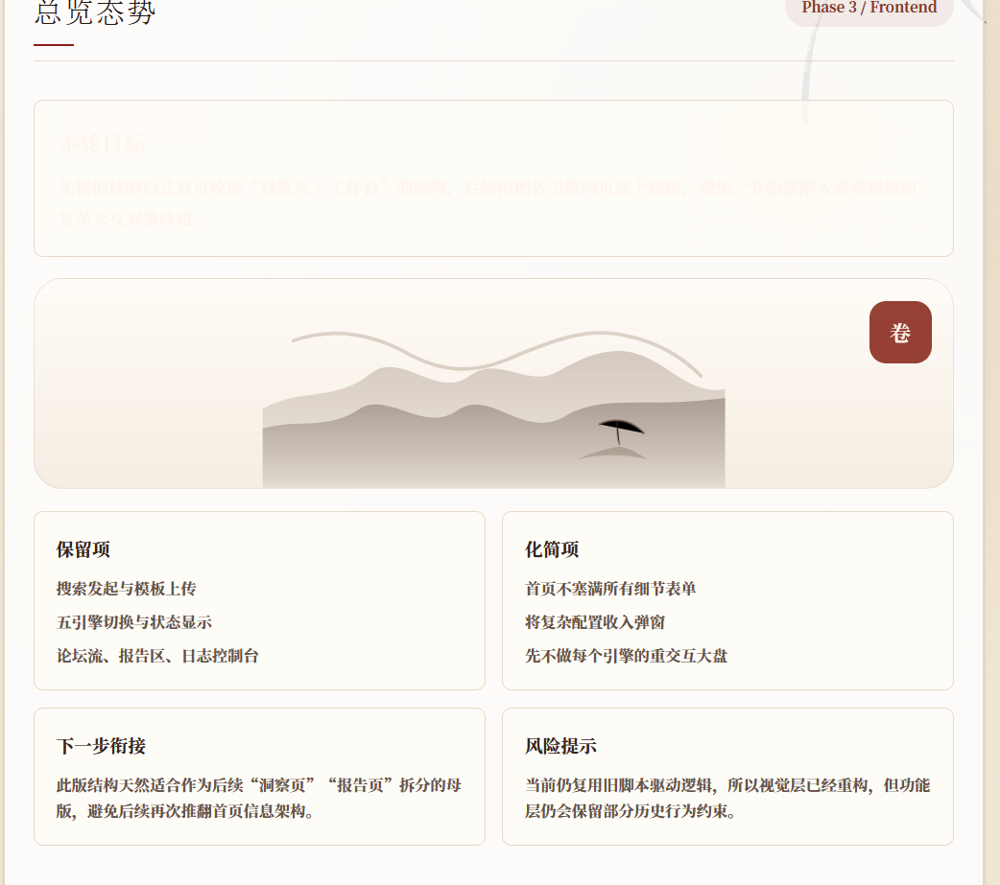

也就是这里的代码

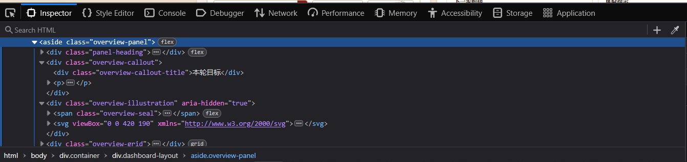

3.index.html的底部标语没有按要求来

实际上：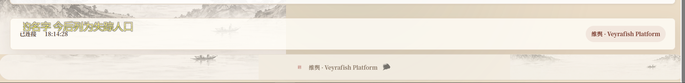

要求：

4.index.html这里也没有按要求

实际上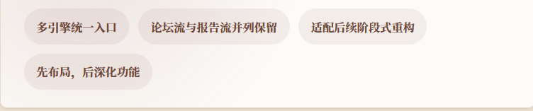

要求，所以要将那个seal-trans.png作为插入放在左边，然后接上这段话

5.这部分的代码要重新构建

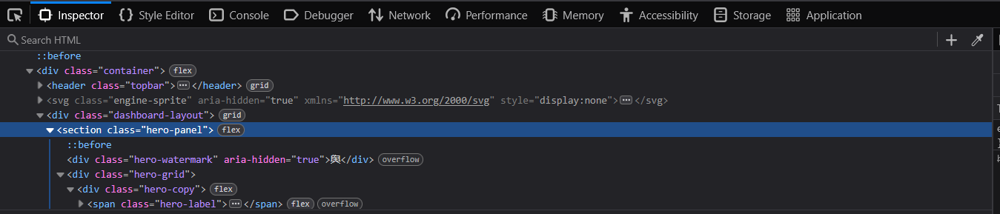

主要是这部分的内容要进行重新修改

这个可以保留

6.这里洞察引擎没有相应的三个词，不协调，需要加上

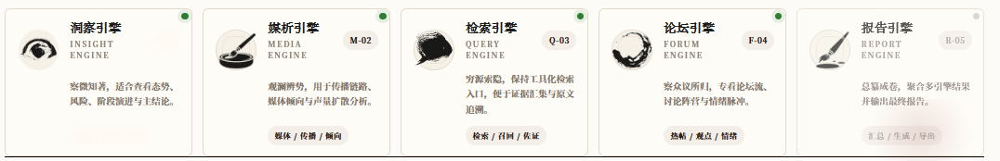

# insight.html

1.底部没有和index.html同步，统一顶部和底部

2.没有正常显示，引擎已经启动了，控制台也有数据，但是这里没有同步上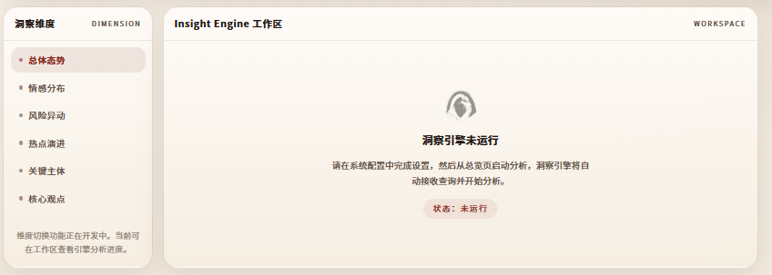

3.这里的布局理解错误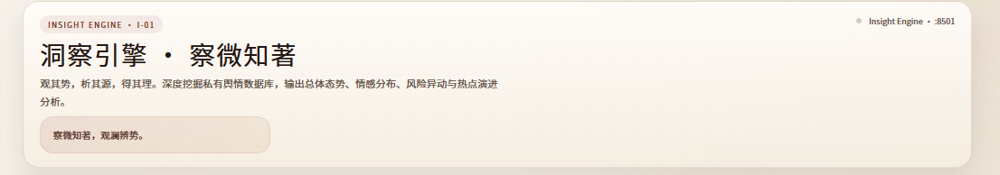

应该是分开的，一个在上，一个在下：

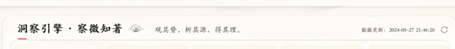

# media.html

1.底部没有和index.html同步，统一顶部和底部

2.没有正常显示，引擎已经启动了，控制台也有数据，但是这里没有同步上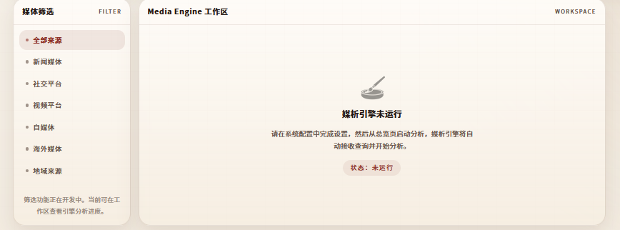

3.这里的布局理解错误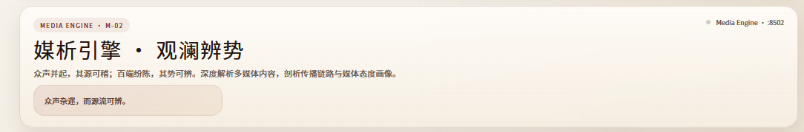

应该是分开的，一个在上，一个在下：

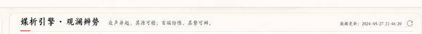

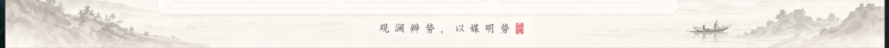

# query.html

1.底部没有和index.html同步，统一顶部和底部

2.没有正常显示，引擎已经启动了，控制台也有数据，但是这里没有同步上

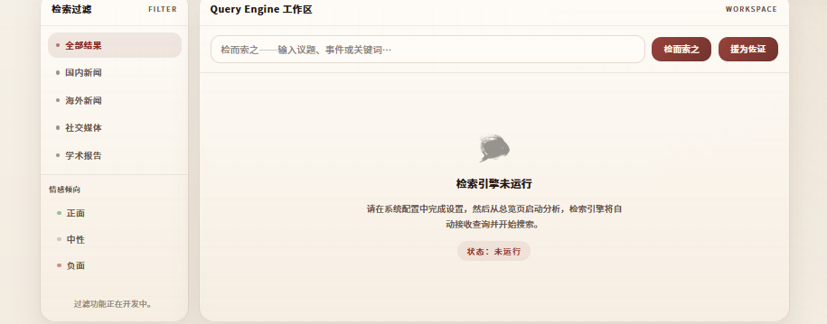

3.这里的布局理解错误

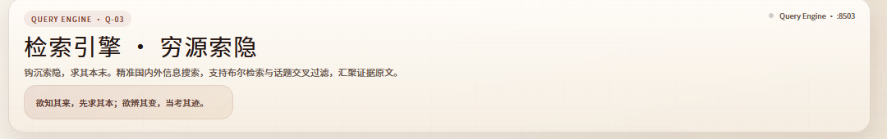

应该是分开的，一个在上，一个在下：

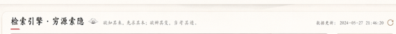

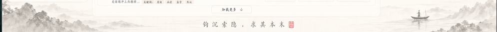

# forum.html

1.底部没有和index.html同步，统一顶部和底部

2.没有正常显示，引擎已经启动了，控制台也有数据，但是这里没有同步上

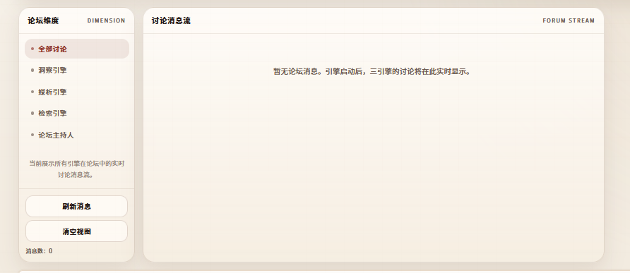

3.这里的布局理解错误

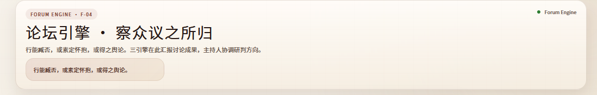

应该是分开的，一个在上，一个在下

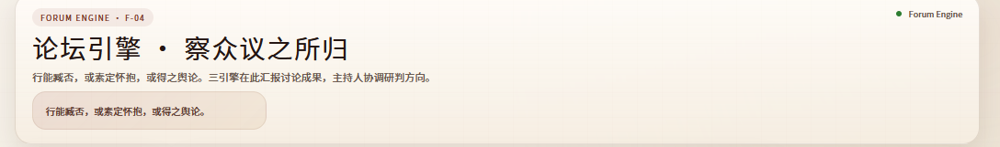

# report.html

1.底部没有和index.html同步，统一顶部和底部

2.没有正常显示，引擎已经启动了，控制台也有数据，但是这里没有同步上

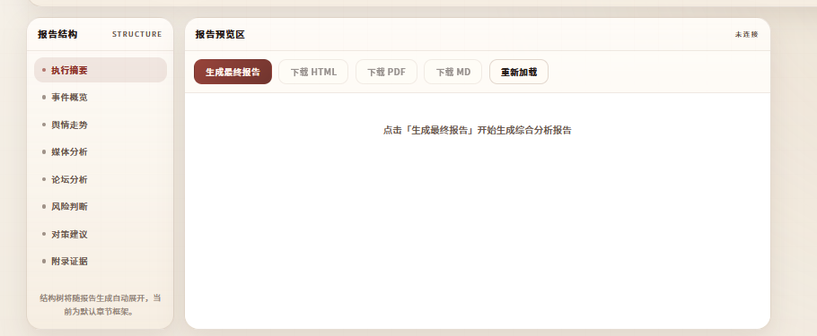

3.这里的布局理解错误

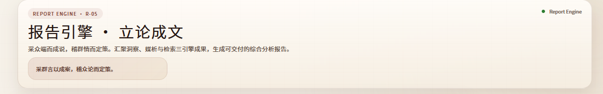

应该是分开的，一个在上，一个在下：

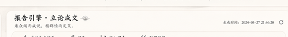

# bug

没有在工作

